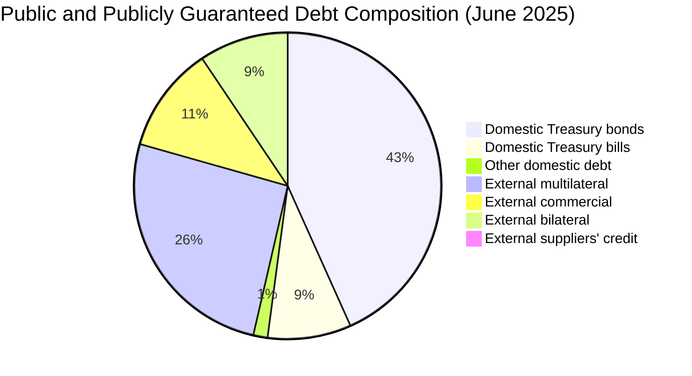

# Current Debt Baseline & Key Statistics (FY 2024/25–2026)

> **Executive summary:** At end-June 2025 (Our latest reports available are 2026 may, right> maybe lets focus on that), Kenya's public and publicly guaranteed (PPG) debt was **KSh 11.814 trillion**, equal to **67.8% of GDP in nominal terms** and **63.7% in present-value terms**. Domestic debt was **53.5%** of the total. By May 2026, the latest complete monthly stock in the June 2026 CBK bulletin had risen to a provisional **KSh 12.896 trillion**, with the domestic share increasing to **56.1%**. In FY 2024/25, debt service was **KSh 1.722 trillion**, equivalent to **71.2% of ordinary revenue**. The central fiscal problem is therefore not only the size of the debt stock, but also its cost: domestic interest alone absorbed **32.1% of ordinary revenue**.

## Reading the dates and definitions

This note separates two observations that should not be mixed:

1. **End-June 2025 fiscal-year baseline:** the National Treasury's retrospective FY 2024/25 report provides debt-to-GDP, debt-service and fiscal ratios.
2. **Latest monthly update:** the CBK's June 2026 bulletin provides a complete total-debt observation through **May 2026**. Its June 2026 column updates domestic debt only, so it cannot be combined with May external debt and presented as a June total.

**Why “gross” debt?** Gross debt records outstanding government debt liabilities before subtracting government financial assets such as deposits. A net-debt measure subtracts specified financial assets, but the result depends on which assets are liquid and genuinely available for debt repayment. Kenya's main Treasury and CBK series reports **public and publicly guaranteed debt on a gross basis** and does not publish a directly comparable headline net-debt series. This note therefore uses gross PPG debt and labels the coverage explicitly.

## 1. Current debt stock and composition

### Fiscal-year baseline and latest monthly update

| Observation | Total PPG debt | Domestic debt | External debt | Domestic / external share | Status |
|---|---:|---:|---:|---:|---|
| **June 2025 — Treasury fiscal-year baseline** | **KSh 11,814.5B** | **KSh 6,326.0B** | **KSh 5,488.5B** | **53.5% / 46.5%** | Provisional FY outturn |
| **May 2026 — latest complete CBK monthly total** | **KSh 12,896.4B** | **KSh 7,239.1B** | **KSh 5,657.3B** | **56.1% / 43.9%** | Provisional monthly data |

The total rose by approximately **KSh 1.08 trillion, or 9.2%**, between June 2025 and May 2026. The CBK separately reports June 2026 gross domestic debt of **KSh 7,327.8 billion**, but not a June external-debt total in the same table.

For scale only, the June 2025 stock was about **US$91.4 billion** at the CBK's June 2025 average exchange rate, while the May 2026 stock was about **US$99.7 billion** at the May 2026 average rate. These are calculated shilling conversions, not measures of the debt's currency composition.

**Source:** National Treasury, *Annual Public Debt Management Report FY 2024/2025*, Table 3, p. 28; CBK, *Monthly Economic Indicators, June 2026*, Tables 4.2, 7.1 and 7.2, pp. 15, 22–23.

### June 2025 composition by instrument and creditor

| Component | Amount (KSh billion) | Share of total debt | Interpretation |
|---|---:|---:|---|
| Domestic Treasury bonds | 5,110.0 | 43.3% | Largest single component; generally longer-dated than Treasury bills |
| Domestic Treasury bills | 1,036.9 | 8.8% | Short-term instruments; stock rose 68% during FY 2024/25 |
| Other domestic debt | 179.1 | 1.5% | Pre-1997 debt, CBK overdraft and other domestic items |
| External multilateral | 3,045.4 | 25.8% | World Bank, IMF, AfDB and other multilaterals; generally more concessional |
| External commercial | 1,322.3 | 11.2% | Sovereign bonds, commercial loans and guaranteed commercial debt |
| External bilateral | 1,106.4 | 9.4% | Government-to-government and guaranteed bilateral loans |
| External suppliers' credit | 14.4 | 0.1% | Small residual creditor category |

**Source:** National Treasury, *Annual Public Debt Management Report FY 2024/2025*, Tables 5 and 10, pp. 34 and 45. Percentages are calculated against total PPG debt and may not sum to exactly 100% because of rounding.



## 2. Historical Trajectory Across Administrations (2002–2026)

To provide the quantitative context required by the Kenya in Data Constitution, the table below harmonizes official National Treasury Annual Public Debt Reports, KNBS CPI deflators (Base 2024=100), and KNBS/CBK rebased GDP series from 2002 to 2026.

### Complete Historical Series: Debt Stock, Deflators & Fiscal Burden

| Fiscal Year | Calendar Year | Administration | Total Debt (KSh B) | Real Debt (2024 KSh B) | Debt-to-GDP (%) | Domestic Share (%) | External Share (%) | Debt Service / Revenue (%) | Domestic Interest / Revenue (%) |
|:---|:---:|:---|---:|---:|---:|---:|---:|---:|---:|
| **FY 2001/02** | 2002 | Moi / Transition | 629.5 | 3,445.5 | 60.8% | 37.6% | 62.4% | 35.7% | 11.7% |
| **FY 2002/03** | 2003 | Kibaki I (Inauguration) | 683.0 | 3,404.8 | 60.3% | 42.3% | 57.7% | 34.7% | 11.6% |
| **FY 2004/05** | 2005 | Kibaki I | 749.6 | 3,037.3 | 52.9% | 42.1% | 57.9% | 27.1% | 8.8% |
| **FY 2006/07** | 2007 | Kibaki I | 805.7 | 2,732.1 | 43.9% | 50.2% | 49.8% | 23.5% | 8.7% |
| **FY 2008/09** | 2009 | Kibaki II | 1,056.2 | 2,826.3 | 32.2% | 49.1% | 50.9% | 22.6% | 8.8% |
| **FY 2010/11** | 2011 | Kibaki II | 1,486.6 | 3,356.5 | 35.7% | 51.4% | 48.6% | 23.2% | 10.0% |
| **FY 2012/13** | 2013 | Kibaki / Uhuru Handover | 1,894.3 | 3,698.4 | 35.7% | 55.5% | 44.5% | 28.2% | 14.1% |
| **FY 2014/15** | 2015 | Uhuru I | 2,843.7 | 4,875.2 | 41.3% | 49.9% | 50.1% | 31.1% | 13.5% |
| **FY 2016/17** | 2017 | Uhuru I | 4,406.3 | 6,584.4 | 51.9% | 47.9% | 52.1% | 39.0% | 16.3% |
| **FY 2018/19** | 2019 | Uhuru II | 5,809.1 | 7,879.9 | 56.7% | 48.0% | 52.0% | 56.5% | 18.2% |
| **FY 2020/21** | 2021 | Uhuru II | 7,697.1 | 9,336.6 | 64.0% | 48.0% | 52.0% | 64.7% | 24.9% |
| **FY 2021/22** | 2022 | Uhuru / Ruto Handover | 8,634.8 | 9,732.6 | 64.0% | 49.7% | 50.3% | 61.2% | 23.8% |
| **FY 2022/23** | 2023 | Ruto | 10,278.7 | 10,754.0 | 68.4% | 47.0% | 53.0% | 68.5% | 26.2% |
| **FY 2023/24** | 2024 | Ruto | 10,556.7 | 10,556.7 | 65.0% | 51.3% | 48.7% | 72.4% | 29.7% |
| **FY 2024/25** | 2025 | Ruto (Baseline) | 11,814.5 | 11,306.8 | 67.8% | 53.5% | 46.5% | 71.2% | 32.1% |
| **FY 2025/26** | 2026 | Ruto (Projected / CBK MEI) | 12,180.0 | 11,177.4 | 69.3% | 54.6% | 45.4% | 69.6% | 31.3% |

> **Machine-Readable Download:**
> - Clean Time Series CSV: [`Data/Published/KID001_Kenya_Public_Debt_2002_2026.csv`](../Data/Published/KID001_Kenya_Public_Debt_2002_2026.csv)
> - Formatted Multi-Sheet Excel Workbook: [`Data/Published/KID001_Kenya_Public_Debt_2002_2026.xlsx`](../Data/Published/KID001_Kenya_Public_Debt_2002_2026.xlsx) (includes Data Dictionary, Key Handover Snapshots, and Primary Source sheets).

---

### Four Key Presidential Handover Snapshots

| Benchmark | Observation Date | Nominal Debt (KSh B) | Constant 2024 KSh B | Nominal GDP (KSh B) | Debt-to-GDP (%) | Debt Service / Revenue (%) |
|:---|:---:|---:|---:|---:|---:|---:|
| **1. Kibaki Inauguration Baseline** | June 2003 | 683.0 | 3,404.8 | 1,131.8 | 60.3% | 34.7% |
| **2. Kibaki to Uhuru Handover** | June 2013 | 1,894.3 | 3,698.4 | 5,311.3 | 35.7% | 28.2% |
| **3. Uhuru to Ruto Handover** | June 2022 | 8,634.8 | 9,732.6 | 13,489.6 | 64.0% | 61.2% |
| **4. Current Verified Baseline** | June 2025 | 11,814.5 | 11,306.8 | 17,434.5 | 67.8% | 71.2% |

---

### Generated Publication Figures

| Figure | Title | Preview & Files |
|:---|:---|:---|
| **FIG-DEBT-001** | Nominal vs. Inflation-Adjusted Public Debt (2002–2026) | [PNG Format](../Figures/Final/FIG-DEBT-001_nominal_vs_real_public_debt.png) • [SVG Vector](../Figures/Final/FIG-DEBT-001_nominal_vs_real_public_debt.svg) |
| **FIG-DEBT-002** | Public Debt as a Share of Kenya's GDP (2002–2026) | [PNG Format](../Figures/Final/FIG-DEBT-002_public_debt_to_gdp.png) • [SVG Vector](../Figures/Final/FIG-DEBT-002_public_debt_to_gdp.svg) |
| **FIG-DEBT-003** | Domestic vs. External Public Debt Mix (2002–2026) | [PNG Format](../Figures/Final/FIG-DEBT-003_domestic_vs_external_composition.png) • [SVG Vector](../Figures/Final/FIG-DEBT-003_domestic_vs_external_composition.svg) |
| **FIG-DEBT-004** | The Debt Servicing Squeeze on Ordinary Revenue (2002–2026) | [PNG Format](../Figures/Final/FIG-DEBT-004_debt_service_to_tax_revenue.png) • [SVG Vector](../Figures/Final/FIG-DEBT-004_debt_service_to_tax_revenue.svg) |

## 3. What the macroeconomic ratios mean

### Debt-to-GDP: 67.8% nominal and 63.7% in present-value terms

Debt-to-GDP compares the debt stock with the economy's annual output and approximate income-generating base. Kenya's **67.8%** ratio means the face value of PPG debt was about KSh 68 for every KSh 100 of annual GDP at June 2025. It does **not** mean 67.8% of GDP is paid each year. The annual cash burden is better captured by interest and debt-service ratios.

The ratio rose from 66.9% to 67.8% in FY 2024/25 because debt accumulated faster than the denominator. A high or rising ratio can narrow the government's capacity to absorb shocks, especially when revenue is low, interest rates are high, maturities are short or a large share of debt requires foreign currency.

Present value discounts future concessional repayments and is therefore lower than the nominal face value. Kenya's **63.7% PV ratio** nevertheless remained above the statutory anchor.

### The 55% statutory debt anchor

Section 50(2A) of the Public Finance Management Act sets the national government's borrowing threshold at **55% of GDP in present-value terms**. Section 50(2B) allows an exceptional deviation of up to **5 percentage points**. The anchor is a fiscal rule intended to guide borrowing and bring debt toward a level considered manageable; it is not a guarantee that debt below 55% is safe or that debt above it automatically causes default.

At **63.7%**, the June 2025 PV ratio was **8.7 percentage points above the 55% anchor** and **3.7 points above the top of the 55% + 5-point exceptional band**. The Act also requires the Cabinet Secretary to take measures to achieve compliance within the statutory transition period. This note describes the measured gap but does not make a legal finding on compliance.

**Sources:** National Treasury, *Annual Public Debt Management Report FY 2024/2025*, pp. 63 and 78; [Public Finance Management Act, section 50](https://new.kenyalaw.org/akn/ke/act/2012/18/eng@2024-04-26).

### Debt-distress assessment: high risk, but still assessed as sustainable

The most recent full joint IMF–World Bank Debt Sustainability Analysis located for Kenya is dated **18 October 2024** and published in **IMF Country Report No. 24/316**. It classifies both the external and overall risk of debt distress as **high**, while assessing debt as **sustainable on a finely balanced basis**. That conclusion depended on timely fiscal consolidation and stronger export performance. The National Treasury's FY 2024/25 report repeats the high-risk/sustainable assessment, and the World Bank's November 2025 *Kenya Economic Update* also describes Kenya as being at high risk of debt distress.

No newer full Board-approved DSA had replaced the October 2024 assessment by the March 2026 IMF staff visit. That March mission was preliminary and explicitly did not result in an IMF Executive Board discussion. The IMF's 2026 technical assistance report on Kenya's public-debt statistics also continued to cite the October 2024 DSA.

**Sources:** [IMF Country Report No. 24/316](https://www.imf.org/-/media/Files/Publications/CR/2024/English/1kenea2024003-print-pdf.ashx), DSA pp. 1 and 18–19 (PDF pp. 131 and 148–149); [IMF March 2026 mission statement](https://www.imf.org/en/news/articles/2026/03/04/pr-26071-kenya-imf-staff-concludes-visit-to-kenya); [World Bank, *Kenya Economic Update*, November 2025](https://documents1.worldbank.org/curated/en/099112125062524216/pdf/P507067-4f692fc7-8081-4630-9dd2-d3768ce9defc.pdf), pp. 8–9.

### Fiscal deficit: target versus estimated outcome

A fiscal deficit occurs when government expenditure exceeds revenue and grants during the year. The gap must be financed through borrowing, asset sales or use of cash balances. Persistent primary deficits add to the debt stock; if borrowing costs exceed growth, the debt ratio can rise even faster.

The FY 2024/25 report contains two figures that refer to different stages of the budget:

- **5.8% of GDP** was the original FY 2024/25 deficit target used in the report's medium-term tables.
- **4.7% of GDP** was the report's later end-June 2025 estimate, described as below the original target.

The 4.7% estimate should therefore be used as the report's latest FY 2024/25 outcome, while 5.8% should be labelled as the initial target rather than an actual result. A lower deficit slows new debt accumulation, but it does not by itself reduce the outstanding stock or the existing debt-service bill.

**Source:** National Treasury, *Annual Public Debt Management Report FY 2024/2025*, pp. 66, 75 and 78.

### International comparison: why Japan and Ghana tell different stories

| Case | Debt ratio and date | What the comparison shows |
|---|---|---|
| **Kenya** | 67.8% of GDP, PPG debt, June 2025 | The ratio is lower than Japan's and Ghana's crisis-era ratio, but revenue, interest cost, maturity and foreign-exchange exposure make Kenya's burden high-risk. |
| **Japan** | 204.4% of GDP, IMF 2026 forecast for general government gross debt | Japan demonstrates that a high debt ratio does not mechanically cause default. Its debt is largely yen-denominated and financed in a much deeper domestic market. Even so, the IMF identifies Japan's high and persistent debt as a major vulnerability. |
| **Ghana at the 2022 crisis** | 88.1% of GDP at end-2022 in the IMF's initial program DSA; later IMF vintages revised the ratio above 90% | Ghana suspended service on external commercial debt in December 2022 and conducted a domestic debt exchange. Its debt-service-to-revenue ratio was about 117.5% in 2022 and gross financing needs were about 19% of GDP—showing that liquidity and refinancing pressure, not the debt ratio alone, drove the crisis. |

These are not perfectly like-for-like statistics: Japan's figure covers general government, while Kenya's headline is a national PPG measure, and Ghana's data were revised during restructuring. The useful lesson is analytical rather than a league table. Countries with strong revenue, deep local markets, long maturities and debt in their own currency can carry more debt than countries with narrow revenue bases, expensive short-term domestic debt and substantial foreign-currency obligations.

**Sources:** [IMF DataMapper, Japan](https://www.imf.org/external/datamapper/profile/JPN), April 2026 WEO; [IMF 2026 Japan Article IV](https://www.elibrary.imf.org/view/journals/002/2026/075/article-A001-en.xml); [IMF Ghana Country Report No. 23/168](https://www.imf.org/-/media/files/publications/cr/2023/english/1ghaea2023001.pdf), pp. 8–9 and DSA pp. 7–8; [IMF Ghana program report](https://www.elibrary.imf.org/abstract/journals/002/2023/168/article-A001-en.xml).

## 4. The debt-servicing squeeze

Total public debt service in FY 2024/25 was **KSh 1,722.1 billion**.

| Measure | FY 2024/25 result | What it means |
|---|---:|---|
| Debt service / ordinary revenue | **71.2%** | Debt service was equivalent to KSh 71.20 for every KSh 100 of ordinary revenue. This is an arithmetic comparison, not a literal earmarking of each tax shilling. |
| Interest / ordinary revenue | **40.8%** | Interest is the cost of carrying the debt and does not reduce principal. |
| Domestic interest / ordinary revenue | **32.1%** | The largest component of the interest burden. |
| External interest / ordinary revenue | **8.7%** | Smaller than domestic interest despite external debt being 46.5% of the stock. |
| Debt service / total public expenditure | **39.0%** | Up from 23.0% in FY 2019/20. |
| Debt service / GDP | **9.9%** | Annual debt-service flow relative to annual output. |

**Ordinary revenue is not the same as KRA tax revenue.** It includes tax and specified non-tax revenue. In addition, the debt-service numerator includes interest and principal but excludes Treasury-bill redemptions from domestic principal. The 71.2% ratio is therefore useful only when its definitions are retained.

**Source:** National Treasury, *Annual Public Debt Management Report FY 2024/2025*, Tables 4 and 27, pp. 30 and 79; fiscal-pressure discussion, p. 31.

## 5. Principal repayments versus interest payments

```text
Total annual debt service: KSh 1,722.1 billion
├── Interest payments:       KSh 987.5 billion  (57.3% of total service)
│   ├── Domestic interest:   KSh 776.3 billion  (78.6% of total interest)
│   └── External interest:   KSh 211.2 billion  (21.4% of total interest)
│
└── Principal repayments:    KSh 734.6 billion  (42.7% of total service)
    ├── External principal:  KSh 367.8 billion
    └── Domestic principal:  KSh 366.8 billion  (excludes Treasury-bill redemptions)
```

The distinction matters. Interest is a fiscal cost. Principal repayment reduces a liability only when it is paid from revenue or other non-debt resources; when a maturing bond is refinanced, the immediate payment appears as debt service but the liability is rolled into a new instrument.

**Source:** National Treasury, *Annual Public Debt Management Report FY 2024/2025*, Table 4, p. 30.

## 6. Implications of the shift toward domestic debt

### Benefits relative to external borrowing

- Domestic debt avoids direct foreign-exchange risk for the government. A weaker shilling does not mechanically increase the face value of shilling-denominated bonds.
- A deeper domestic government-securities market gives pension funds, insurers, banks and households local-currency savings instruments and can help build a benchmark yield curve.
- Domestic issuance reduces dependence on volatile international capital markets and external refinancing windows.

### Costs and risks

- **Higher interest cost:** domestic debt was 53.5% of the stock but generated 78.6% of total interest in FY 2024/25. By June 2025, Treasury-bill rates had fallen to **8.1%–9.7%**, down from **16.0%–16.8%** a year earlier, but the interest bill still reflected the larger stock and earlier high-cost issuance.
- **Crowding out:** commercial banks held **34.7% of domestic debt** at June 2025. When risk-adjusted government securities offer attractive returns, banks can prefer them to business loans. This can reduce the amount of credit available to firms or keep lending rates high, particularly for SMEs viewed as riskier.
- **Benchmark pricing:** government yields form a reference rate for the rest of the economy. High sovereign yields raise the minimum return lenders require from private borrowers.
- **Refinancing risk:** the share of Treasury bills and bonds maturing within one year increased to **21.7%** in FY 2024/25. Frequent rollover leaves the budget exposed to sudden increases in market rates or weak auction demand.
- **Bank–sovereign concentration:** large bank holdings make government financing more stable in normal periods, but they also tie bank balance sheets more closely to sovereign risk.

Crowding out is not automatic: its strength depends on banking-system liquidity, private credit demand, monetary policy and the depth of domestic savings. In this period, however, both the Treasury and the World Bank explicitly identify increased domestic borrowing as a constraint on private-sector credit.

External debt has the opposite trade-off. Concessional multilateral loans are often cheaper and longer-dated, but external debt exposes the budget to exchange-rate depreciation, foreign-currency liquidity needs and international refinancing conditions. The policy objective should therefore be a resilient mix, not simply “domestic good” or “external bad.”

**Sources:** National Treasury, *Annual Public Debt Management Report FY 2024/2025*, pp. 35–41 and 43–45; [World Bank, *Kenya Economic Update*, November 2025](https://documents1.worldbank.org/curated/en/099112125062524216/pdf/P507067-4f692fc7-8081-4630-9dd2-d3768ce9defc.pdf), pp. 8–9; [IMF Country Report No. 24/316](https://www.imf.org/-/media/Files/Publications/CR/2024/English/1kenea2024003-print-pdf.ashx), DSA pp. 18–19.

## 7. Strategic takeaways

1. **Kenya's most immediate constraint is debt service, not the headline stock alone.** A 71.2% debt-service-to-ordinary-revenue ratio leaves limited room for services, transfers and development spending.
2. **The domestic shift reduces foreign-exchange exposure but raises fiscal and private-credit costs.** Domestic interest absorbed 32.1% of ordinary revenue, while banks' increased government-security holdings create a credible crowding-out channel.
3. **The portfolio has become more exposed to short-term refinancing.** Treasury bills rose 68% in FY 2024/25 and the share of securities maturing within a year increased.
4. **Fiscal consolidation must be judged by outcomes, not targets.** The FY 2024/25 estimated deficit was below the original target, but total debt still rose faster than GDP and debt service remained elevated.
5. **Debt sustainability is finely balanced.** Kenya has not been assessed as being in debt distress, but the latest full joint DSA classifies the risk as high and makes sustainability conditional on fiscal adjustment and export growth.

The National Treasury estimates that debt service, county transfers, salaries and pensions together accounted for **63.9% of public expenditure** in FY 2024/25. Development expenditure accounted for approximately **12%**, illustrating how debt and other rigid commitments compress fiscal choice.

**Source:** National Treasury, *Annual Public Debt Management Report FY 2024/2025*, p. 31.

## 8. Source verification

1. **National Treasury of Kenya:** [*Annual Public Debt Management Report FY 2024/2025*](https://www.treasury.go.ke/wp-content/uploads/2025/11/Annual-Public-Debt-Report-2024-2025.pdf), published in 2025.
   - Debt stock and five-year trend: Table 3, p. 28.
   - Debt service and ordinary revenue: Table 4, p. 30.
   - Fiscal pressure and expenditure composition: p. 31.
   - Domestic instruments and holders: Tables 5–6, pp. 34–36.
   - Maturity and Treasury-bill rates: pp. 39–41.
   - Domestic interest: pp. 43–44.
   - External creditor composition: Table 10, p. 45.
   - Debt sustainability and fiscal deficit: pp. 63–66 and 75.
   - Medium-term projections: Tables 26–27, pp. 78–79.
   - Local copy: `Projects/PRJ-001 Kenya Public Debt/Sources/Documents/TNT_Annual_Public_Debt_Report_2024_2025.pdf`.

2. **Central Bank of Kenya:** [*Monthly Economic Indicators, June 2026*](https://www.centralbank.go.ke/uploads/monthly_economic_indicators/355702775_MEI%20-%20June%202026.pdf).
   - Monthly exchange rates: Table 4.2, p. 15.
   - Complete PPG debt series through May 2026: Table 7.1, p. 22.
   - Domestic debt by instrument through June 2026: Table 7.2, p. 23.
   - Local copy: `Projects/PRJ-001 Kenya Public Debt/Sources/Documents/CBK_MEI_June_2026.pdf`.

3. **Historical National Treasury reports:** [Annual Debt Management Reports archive](https://www.treasury.go.ke/annual-debt-management-reports-0).
   - *Public Debt Annual Report 2005/06*, Executive Summary p. v.
   - *Annual Public Debt Management Report 2012/13*, Table 1.1, p. 6.
   - *Annual Public Debt Management Report 2021/22*, Chapter 4, p. 10.
   - Local copies are stored in `Projects/PRJ-001 Kenya Public Debt/Sources/Documents/`.

4. **IMF and World Bank:** [IMF Country Report No. 24/316](https://www.imf.org/-/media/Files/Publications/CR/2024/English/1kenea2024003-print-pdf.ashx), DSA pp. 1 and 18–19; [World Bank, *Kenya Economic Update*, November 2025](https://documents1.worldbank.org/curated/en/099112125062524216/pdf/P507067-4f692fc7-8081-4630-9dd2-d3768ce9defc.pdf), pp. 8–9.

5. **Legal source:** [Public Finance Management Act](https://new.kenyalaw.org/akn/ke/act/2012/18/eng@2024-04-26), section 50(2A)–(2C).

## 9. How the review comments were addressed

| Review comment | Resolution in this revision |
|---|---|
| Is there gross and net public debt? Why say gross? | Added a definition explaining gross versus net debt, why asset coverage matters and why the official gross PPG series is used. |
| Show how domestic versus external debt has changed. | Added a consistent five-year table, a longer-run administration-milestone table and an explanation of exchange-rate effects. |
| Explain the implications of more domestic debt and the effect on business borrowing. | Added a dedicated section on foreign-exchange benefits, interest cost, crowding out, benchmark pricing, refinancing risk and bank–sovereign concentration. |
| Add exact sources, document names, links and pages. | Added inline source notes throughout and a source-verification section with direct official links, tables and page numbers. |
| Explain the debt-to-GDP ratio and compare it with Japan, previous administrations and Ghana. | Added a plain-language explanation, administration milestones and a cautious international comparison that distinguishes debt definitions and crisis conditions. |
| Explain the statutory debt anchor. | Added the legal meaning of the 55% PV anchor, the exceptional 5-point allowance and Kenya's measured gap from both levels. |
| Date the IMF assessment and identify other similar assessments. | Identified the October 2024 joint IMF–World Bank DSA as the latest full assessment located, clarified the status of the March 2026 IMF mission and cited the Treasury and World Bank follow-on assessments. |
| Explain the fiscal deficit and its implications. | Defined the deficit, explained its debt effect and corrected the draft's mixing of the 5.8% target with the report's later 4.7% estimate. |

### Additional corrections made during verification

- Separated the June 2025 fiscal-year baseline from the May/June 2026 monthly update.
- Replaced “ordinary tax revenue” and “KRA tax revenue” with the source's broader term, **ordinary revenue**.
- Corrected the June 2025 Treasury-bill rates to **8.1%–9.7%**; the 16%–17% range applied to June 2024.
- Corrected the detailed debt-composition chart and reconciled its components to the June 2025 stock.
- Added the Treasury report's footnote that domestic principal excludes Treasury-bill redemptions.
- Qualified cross-country and cross-administration comparisons for differences in coverage, revisions and economic structure.

---

## 10. Instructions for Plotting & Reproducible Visualizations

To ensure visual consistency and epistemic rigor across all Kenya in Data releases, all figures in this note are generated via a scriptable, open pipeline.

### A. Core Tooling & Setup
1. **Graphics Engine:** Python 3 (`matplotlib`, `seaborn`, `pandas`, `openpyxl`).
2. **Shared Theme:** [`Code/kid_theme.py`](file:///Users/bosho/Vaults/Bosho%20OS/Bosho%20OS/Venture%20Studio/Projects/Kenya%20in%20Data/Code/kid_theme.py) enforces official brand tokens:
   - Primary Text / Navy: `#0F172A`
   - Chart Background / Light: `#F8FAFC`
   - Debt / Distress Crimson: `#DC2626`
   - Revenue / Emerald: `#059669`
   - External / Gold: `#D97706`
   - Domestic / Royal Blue: `#2563EB`
   - Gridlines / Slate: `#64748B`

### B. Standard Layout Structure (3-Tier Frame)
- **Top Header:** Publication tracker (`KENYA IN DATA • FIG-ID`), 16–18pt bold title, and 10–11pt regular subtitle framing the core question.
- **Canvas Area:** 16:9 widescreen or 1:1 square card, subtle vertical administration shading (`add_administration_shading`), and direct line end-labels (`add_end_line_label`) instead of floating legend boxes.
- **Bottom Footer:** Granular data provenance (institution, report, table, page number) and brand stamp (`kenyaindata.org • @KenyaInData`).

### C. Commands to Reproduce Figures & Datasets
From the project workspace root:
```bash
# 1. Recompute normalized time series and Excel workbooks
.venv/bin/python3 "Projects/PRJ-001 Kenya Public Debt/Code/compute_debt_series.py"

# 2. Regenerate all dual SVG + PNG publication figures
.venv/bin/python3 "Projects/PRJ-001 Kenya Public Debt/Code/generate_debt_figures.py"

# 3. Synchronize catalog checksums
.venv/bin/python3 "Projects/PRJ-001 Kenya Public Debt/Code/sync_data_catalog.py"
```

For guidelines on applying these conventions to new projects (`PRJ-002`, `PRJ-003`, etc.), see the dedicated guide: [`Operations/skills/kid-visualization/SKILL.md`](file:///Users/bosho/Vaults/Bosho%20OS/Bosho%20OS/Venture%20Studio/Projects/Kenya%20in%20Data/Operations/skills/kid-visualization/SKILL.md).

