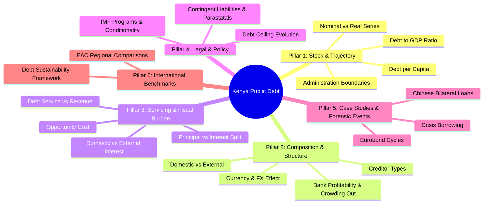

# Kenya Public Debt — Master Research Outline & 10-Hour MVP Blueprint

> **Purpose:** 
> 1. Provide a comprehensive, long-term taxonomy of all analytical and journalistic work that can be conducted on Kenya's public debt.
> 2. Define an actionable, bounded **10-Hour / 1-Week Micro-Project** that produces an essay, publication-ready figures, social copy, and a verified open dataset.

---

## Part 1: The 10-Hour / 1-Week Micro-Project Blueprint

**Working Title:** *Kenya’s Public Debt Across Presidencies: What Changes When You Add Inflation, GDP, and the Shilling?*  
**Deliverables:** 3 high-contrast figures + 1,000-word data essay + social thread + downloadable CSV source table.

```mermaid
gantt
    title 10-Hour Project Execution Schedule
    dateFormat  X
    axisFormat %d
    section Data & Pipeline
    Data Harvesting (CBK, Treasury, KNBS) :0, 2
    Calculation & Deflator Pipeline (Python) :2, 4
    section Visuals & Analysis
    Chart Production (3 Figures) :4, 6
    Essay & Narrative Drafting :6, 8
    section Verification & Release
    Audit, Sourcing & Social Packaging :8, 10
```



### Hour-by-Hour Breakdown

| Block | Focus | Specific Tasks | Output Artifact |
| :--- | :--- | :--- | :--- |
| **Hours 1–2** | **Data Harvesting & Ingestion** | • Download CBK Historical Debt Bulletins (2002–2026).<br>• Download KNBS GDP (nominal/real) & GDP Deflator series.<br>• Download Treasury Revenue & Debt Service time series. | `Data/raw/` CSV files & source PDFs |
| **Hours 3–4** | **Data Processing & Transformations** | • Normalize fiscal year vs calendar year boundaries.<br>• Apply GDP deflator to convert nominal series to constant 2024 KSh.<br>• Calculate Debt/GDP ratios, annual growth rates, and administration splits. | `Data/processed/kid001_debt_1998_2026.csv` |
| **Hours 5–6** | **Figure Generation (Kenya in Data Theme)** | • **Figure 1:** Nominal vs Real Debt (2002–2026) with shaded presidential eras.<br>• **Figure 2:** Public Debt as % of GDP.<br>• **Figure 3:** Debt Service as % of Ordinary Tax Revenue. | Exported PNG/SVG in `Figures/` |
| **Hours 7–8** | **Essay & Write-Up** | • Draft structured 1,000-word essay (*The Problem with Nominal Slogans, The Inflation Adjustment, The Burden of Debt Service*).<br>• Write plain-English findings and methodological caveats. | `Publications/KID-001/Essay.md` |
| **Hours 9–10** | **Verification, Sourcing & Social Release** | • Cross-audit figures against original Treasury tables.<br>• Format citation footnotes and prepare open data download link.<br>• Draft X thread (5–7 posts) and LinkedIn carousel summary. | `Publications/KID-001/Caption.md` & verification sign-off |

---

## Part 2: Comprehensive Master Public Debt Agenda

This taxonomy organizes the long-term research agenda into 6 modular pillars that can be built and published incrementally over months.



---

### Pillar 1: Debt Stock & Historical Trajectory (1963 / 2000–2026)

* **Long-run Growth:** Tracking debt growth from early post-independence to the structural adjustment era (1980s–90s) through to the 2002–2026 expansion.
* **The Deflator & Purchasing Power:**
  * Converting raw shillings into constant prices using both the **GDP Deflator** (macroeconomic production deflator) and **CPI** (consumer price index).
  * Demonstrating why a KSh 2 billion loan in 1980 or KSh 1 trillion in 2008 represents a completely different volume of economic resources than in 2026.
* **Debt-to-GDP & Rebasing:**
  * Tracking the debt burden against national output.
  * Accounting for the **2014 and 2021 GDP rebasings** (which mechanically lowered the debt-to-GDP percentage overnight without changing the debt stock).
* **Debt per Capita:** 
  * Gross debt divided by total population ($KSh\text{ owed per Kenyan}$).

---

### Pillar 2: Debt Composition & Structural Mechanics

#### A. External Debt (Foreign Currency Exposure)
* **Creditor Category Shifts:**
  * **Multilateral:** World Bank (IDA/IBRD), IMF, African Development Bank (AfDB) — low interest, long maturities.
  * **Bilateral:** China (Exim Bank), Japan (JICA), France, UK, Germany — infrastructure-linked.
  * **Commercial:** Sovereign Eurobonds, syndicated commercial bank loans — high interest rates (7%–10%+), strict repayment cliff edges.
* **The Currency & Exchange Rate Revaluation Effect:**
  * Decomposing the annual increase in KSh-denominated external debt into:
    1. **Net new borrowing** (actual cash received).
    2. **Exchange rate revaluation** (e.g. when KES fell from 115 to 160 per USD in 2022–2023, external debt jumped hundreds of billions of shillings purely due to currency depreciation).
* **Currency Mix:** Breakdown across USD, EUR, CNY, JPY, and SDR.

#### B. Domestic Debt & The Banking Nexus
* **Instruments:** Treasury Bills (91, 182, 364 days) vs. Treasury Bonds (2–30 year fixed coupon, tax-free Infrastructure Bonds).
* **Holders of Domestic Debt:**
  * Commercial banks (~45–50%)
  * Pension funds (NSSF, private schemes) (~30%)
  * Insurance companies (~7%)
  * Retail and individual investors (~6%)
  * Central Bank of Kenya.
* **The "Crowding Out" Mechanism:**
  * How high domestic yields (14%–17% on T-bills/bonds) incentivize commercial banks to lend to the state rather than extending private sector / SME credit.
  * Analysis of bank profitability, dividend payouts, and earnings derived from risk-free government securities.

---

### Pillar 3: Debt Servicing Burden & Fiscal Liquidity

* **The Revenue Absorption Metric:**
  * *For every KSh 100 in ordinary revenue collected by KRA, how many shillings go directly to debt repayment?* (Tracking the rise from ~KSh 25 in 2012 to over KSh 60–65 in recent cycles).
* **Principal vs. Interest Breakdown:**
  * Separating roll-over refinancing (principal) from pure fiscal drag (interest payments).
  * Highlighting why interest payments alone now surpass national development spending.
* **Domestic vs. External Cost Asymmetry:**
  * Domestic debt accounts for ~50% of the debt stock but frequently consumes 65%–75% of total interest expenditure due to high domestic interest rates.
* **Fiscal Trade-offs (Opportunity Cost):**
  * Comparing annual debt service against national expenditure on:
    * Ministry of Health
    * Teachers Service Commission & Basic Education
    * Equalization Fund & County equitable revenue share.

---

### Pillar 4: Institutional, Legal & Governance Framework

* **The Parliamentary Debt Ceiling Evolution:**
  * The history of legislative limit adjustments:
    * Statutory ceiling raised from KSh 1.2T $\rightarrow$ KSh 2.5T $\rightarrow$ KSh 6.0T $\rightarrow$ KSh 9.0T $\rightarrow$ KSh 10.0T.
    * Shift to a debt anchor (% of GDP at Present Value, target 55% of GDP).
* **IMF Programs & Policy Conditionality:**
  * Analysis of Extended Fund Facility (EFF) and Extended Credit Facility (ECF) agreements.
  * How IMF fiscal consolidation targets influence Finance Acts, VAT measures, and public wage bill policies.
* **Contingent Liabilities & Off-Balance-Sheet Risks:**
  * Government-guaranteed debt for State-Owned Enterprises (Kenya Airways, Kenya Power, KenGen).
  * Public-Private Partnership (PPP) commitments and annuity roads.
  * County pending bills and supplier arrears as informal internal debt.

---

### Pillar 5: Case Studies & Forensic Debt Events

* **The Eurobond Cycle (2014–2024):**
  * Debut 2014 issuance ($2.75B) and the controversies over proceeds utilization.
  * Subsequent issuances (2018, 2019, 2021) and the June 2024 $2.0B maturity refinancing/buyback.
* **Standard Gauge Railway (SGR) Financing:**
  * China Exim Bank loans for Phase 1 (Mombasa–Nairobi) and Phase 2A (Nairobi–Naivasha).
  * Repayment schedule, Railway Development Levy (RDL), and freight revenue vs debt servicing.
* **Crisis Response Borrowing:**
  * Post-2007 election reconstruction, 2020 COVID-19 emergency support, 2022–2023 global commodity shock funding.

---

### Pillar 6: Regional & International Benchmarks

* **East African Community (EAC) Comparisons:**
  * Kenya vs Tanzania vs Uganda vs Rwanda (Debt/GDP, Debt Service/Revenue, Eurobond yields).
* **Sub-Saharan Africa Frontier Context:**
  * Comparing Kenya’s trajectory with economies that underwent debt restructuring (Ghana, Zambia, Sri Lanka) vs resilient peer economies.
* **Debt Sustainability Assessment (DSA):**
  * Tracking Kenya's official risk rating from the IMF/World Bank (transition from *"Moderate"* to *"High risk of debt distress"*).

---

## Part 3: Raw Brainstorm Archive (Preserved Source Notes)

*Below are the raw initial questions and points captured prior to structuring:*

```text
Basics:
- How much debt are we servicing now?
	- What percentage of government budget goes to paying debt:
		- Principal
		- Interests
	- Domestic vs Foreign debt
		- Domestic (Amount, Implications, International comparison)
		- Foreign (Amount, Implications)
	- Impact of inflation and exchange rates

Historical debt:
- Change of debt over the last 50 years (zoom into last 3 administrations).
- Repayments: Interests/Principal, ratio to GDP, inflation adjustment (e.g. what a 2B KES loan looks like today).
- Debt to GDP ratio (international comparisons).
- Debt Ceiling evolution in Parliament.
- Major debts taken: Eurobonds, SGR, etc.
- IMF and other interventions.
- Banking sector: local bank profits/dividends from government paper and bonds.
```