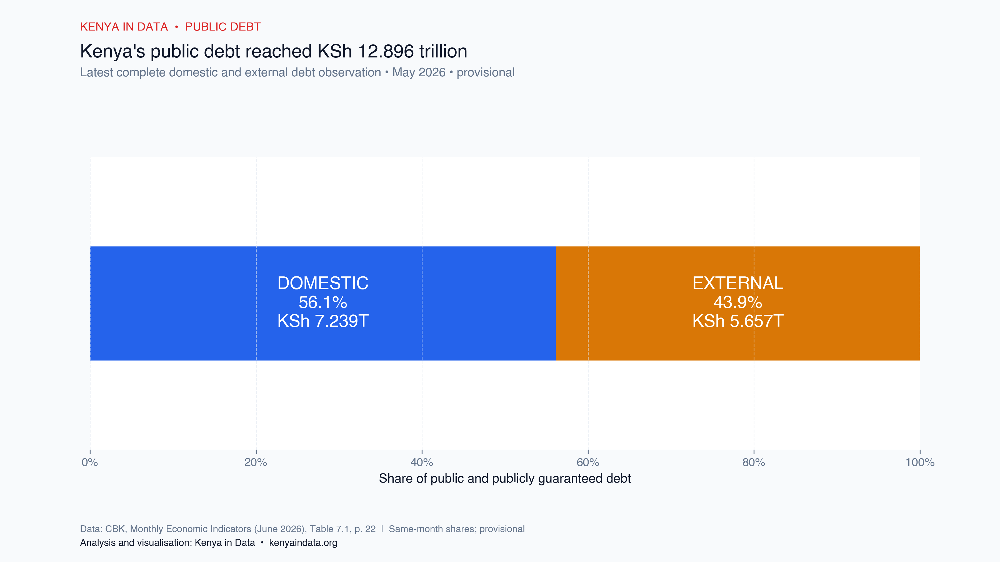
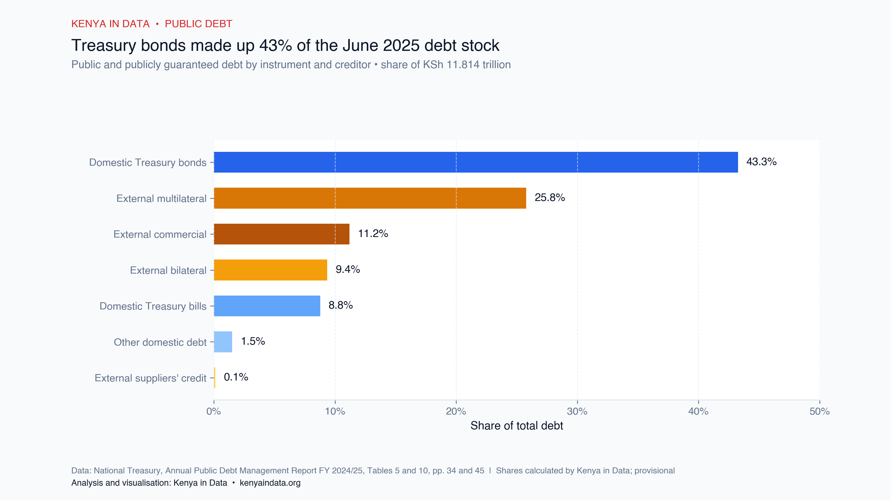
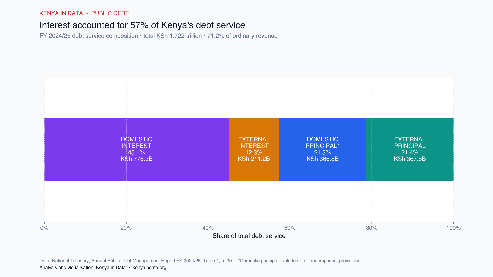
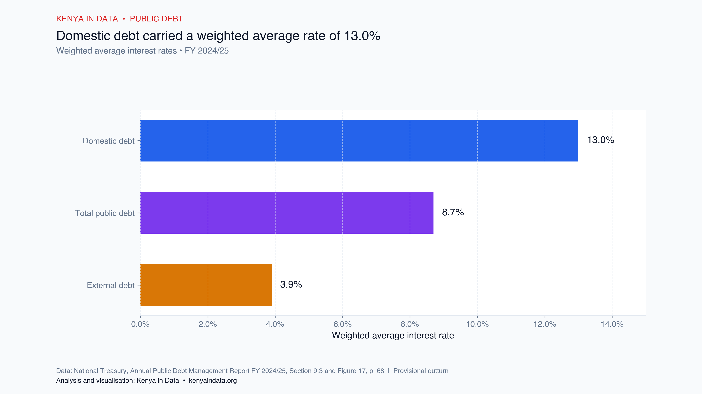
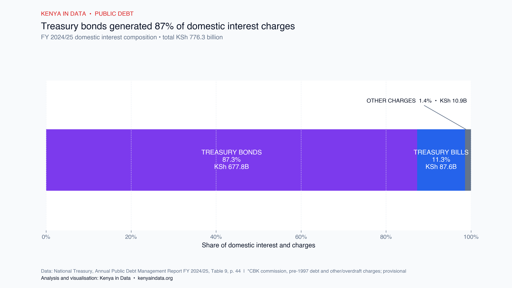
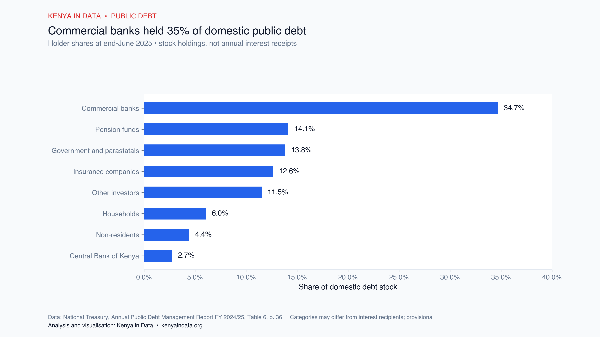

# Kenya's Public Debt: Stock, Composition and Servicing Costs

*A current, source-based account of how much Kenya owes, how the debt is structured and how much it costs to service.*

<!-- Canonical publication document: every chart, caption, social post, infographic, PDF and deck in KID-001 must be derived from this article. -->

## Key findings

- Kenya's public and publicly guaranteed debt stood at **KSh 12.896 trillion in May 2026**, the latest month in the selected Central Bank of Kenya bulletin with complete domestic and external totals.
- Domestic debt accounted for **56.1%** of the May 2026 total, compared with **43.9%** for external debt.
- The National Treasury's detailed June 2025 baseline placed public debt at **KSh 11.814 trillion**, or **67.8% of GDP** in nominal terms.
- Debt service reached **KSh 1.722 trillion in FY 2024/25**, equivalent to **71.2% of ordinary revenue**.
- Domestic debt carried a **13.0% weighted average interest rate**, compared with **3.9%** for external debt. Treasury bonds generated **87.3%** of domestic interest and charges.
- The present value of debt was **63.7% of GDP**, 8.7 percentage points above the statutory anchor of 55%.

## Reporting scope and dates

This report uses two observation dates because Kenya's official debt publications serve different purposes and are released on different schedules.

- **May 2026** provides the most recent complete monthly total in the Central Bank of Kenya's June 2026 *Monthly Economic Indicators*.
- **June 2025** provides the latest full fiscal-year account of debt composition, debt service, interest rates and debt-to-GDP ratios in the National Treasury's *Annual Public Debt Management Report FY 2024/25*.

Public and publicly guaranteed debt includes borrowing undertaken directly by the national government and debt for which the government has formally promised repayment if the original borrower cannot pay. Both source publications describe the relevant observations as provisional (Central Bank of Kenya [CBK], 2026, Table 7.1, p. 22; National Treasury, 2025, Tables 3–4, pp. 28–30).

Debt-to-GDP ratios are reported only for June 2025. Applying the June 2025 GDP measure to the May 2026 debt stock would combine different reporting periods and would not produce a valid current ratio.

## Public debt reached KSh 12.896 trillion in May 2026

At the end of May 2026, Kenya's public and publicly guaranteed debt stood at **KSh 12.896 trillion**. Domestic debt was **KSh 7.239 trillion**, while external debt was **KSh 5.657 trillion** (CBK, 2026, Table 7.1, p. 22).

| Component | KSh trillion | Share of total |
|---|---:|---:|
| Domestic debt | 7.239 | 56.1% |
| External debt | 5.657 | 43.9% |
| **Total public and publicly guaranteed debt** | **12.896** | **100.0%** |

*Figure 1. Kenya's public and publicly guaranteed debt composition, May 2026. Data: CBK (2026), Table 7.1, p. 22. Analysis and visualisation: Kenya in Data. Shares are calculated from same-month values; figures are provisional.*

At June 2025, the corresponding shares were **53.5% domestic** and **46.5% external**. The May 2026 release therefore reported a domestic share 2.6 percentage points higher than the June 2025 fiscal-year baseline (CBK, 2026, Table 7.1, p. 22; National Treasury, 2025, Table 3, p. 28).

The reported debt total was KSh 1.082 trillion, or 9.2%, higher in May 2026 than in June 2025. This is a comparison between two official snapshots, not a fully reconciled borrowing-flow calculation. New borrowing, repayments, exchange-rate movements, classifications and later revisions can all affect the difference between the releases.

## Treasury bonds dominated the June 2025 debt stock

The June 2025 fiscal-year report provides the detailed instrument and creditor composition that is not available for every category in the May 2026 monthly total (National Treasury, 2025, Tables 5 and 10, pp. 34 and 45).

| Component | KSh billion | Share of total debt |
|---|---:|---:|
| Domestic Treasury bonds | 5,110.010 | 43.25% |
| Domestic Treasury bills | 1,036.875 | 8.78% |
| Other domestic debt | 179.124 | 1.52% |
| External multilateral debt | 3,045.391 | 25.78% |
| External commercial debt | 1,322.292 | 11.19% |
| External bilateral debt | 1,106.363 | 9.36% |
| External suppliers' credit | 14.419 | 0.12% |
| **Total public and publicly guaranteed debt** | **11,814.474** | **100.00%** |

*Figure 2. Composition of Kenya's public and publicly guaranteed debt, June 2025. Data: National Treasury (2025), Tables 5 and 10, pp. 34 and 45. Analysis and visualisation: Kenya in Data.*

Treasury bonds were the largest single component, representing 43.25% of the total debt stock and about four-fifths of domestic debt. “Other domestic debt” comprises the difference between total domestic debt and the reported Treasury-bond and Treasury-bill stocks. Commercial and bilateral external debt include the associated government-guaranteed amounts reported in Treasury Table 10.

The domestic portfolio was not exclusively short-term. Treasury bonds had a weighted average time to maturity of 7.5 years at June 2025. However, Treasury bills and securities approaching maturity continued to expose the government to refinancing and interest-rate risk (National Treasury, 2025, pp. 39–41).

## Debt service absorbed 71.2% of ordinary revenue

Kenya spent **KSh 1.722 trillion** on debt service in FY 2024/25. Interest payments accounted for KSh 987.495 billion, or 57.34% of the total. Principal repayments accounted for KSh 734.609 billion, or 42.66% (National Treasury, 2025, Table 4, p. 30).

| Debt-service component | KSh billion | Share of total service | Share of ordinary revenue |
|---|---:|---:|---:|
| Domestic interest | 776.257 | 45.08% | 32.07% |
| External interest | 211.238 | 12.27% | 8.73% |
| **Total interest** | **987.495** | **57.34%** | **40.80%** |
| Domestic principal | 366.805 | 21.30% | 15.16% |
| External principal | 367.804 | 21.36% | 15.20% |
| **Total principal** | **734.609** | **42.66%** | **30.35%** |
| **Total debt service** | **1,722.104** | **100.00%** | **71.16%** |

*Figure 3. Composition of Kenya's debt service, FY 2024/25. Data: National Treasury (2025), Table 4, p. 30. Analysis and visualisation: Kenya in Data. Domestic principal excludes routine Treasury-bill redemptions; figures are provisional.*

Ordinary revenue is the Treasury's measure of tax and recurring non-tax revenue. It is not limited to Kenya Revenue Authority tax collections. The debt-service ratio indicates the scale of debt payments relative to this revenue measure; it does not describe how every remaining shilling was allocated across the budget.

### Domestic debt carried a substantially higher average interest rate

Domestic and external principal repayments were almost equal in FY 2024/25, at about KSh 367 billion each, but domestic interest was more than three times external interest. The similarity in principal repayments does not imply that interest payments should also be similar. Principal reflects debt falling due during the year, while interest reflects the price and terms of the wider debt stock.

The Treasury's weighted average interest rates provide the clearest measure of this difference. The domestic rate was **13.0%**, compared with **3.9%** for external debt and **8.7%** for the total public debt portfolio (National Treasury, 2025, Section 9.3 and Figure 17, p. 68).

*Figure 4. Weighted average interest rates on Kenya's public debt, FY 2024/25. Data: National Treasury (2025), Section 9.3 and Figure 17, p. 68. Analysis and visualisation: Kenya in Data.*

Three features of the portfolio help explain the interest-payment gap:

1. The domestic debt stock was larger at June 2025: **KSh 6.326 trillion**, compared with **KSh 5.488 trillion** in external debt (National Treasury, 2025, Table 3, p. 28).
2. Domestic debt was concentrated in market-priced Treasury securities, while **55.5% of external debt was owed to multilateral creditors**. Multilateral lending often includes longer repayment periods or below-market terms (National Treasury, 2025, Tables 5 and 10, pp. 34 and 45; Section 9.3, p. 68).
3. The reported domestic-principal figure excludes routine Treasury-bill redemptions. It therefore does not represent every domestic security that matured during the year (National Treasury, 2025, Table 4, p. 30).

These factors explain the broad difference in cost. A complete decomposition would require average debt stocks during the year, security-level coupons and maturity dates, external-loan terms, fees and exchange-rate effects.

### Treasury bonds generated most domestic interest charges

Treasury bonds generated **KSh 677.762 billion**, or **87.3%**, of domestic interest and charges in FY 2024/25. Treasury-bill interest and discounts contributed KSh 87.560 billion, or 11.3%. The remaining KSh 10.935 billion comprised Central Bank commission, pre-1997 debt interest and other or overdraft charges (National Treasury, 2025, Table 9, p. 44).

| Domestic interest component | KSh billion | Share of domestic interest |
|---|---:|---:|
| Treasury bonds | 677.762 | 87.3% |
| Treasury bills | 87.560 | 11.3% |
| Other interest and charges | 10.935 | 1.4% |
| **Total domestic interest and charges** | **776.257** | **100.0%** |

*Figure 5. Domestic interest and charges by instrument, FY 2024/25. Data: National Treasury (2025), Table 9, p. 44. Analysis and visualisation: Kenya in Data.*

### Commercial banks held the largest share of domestic debt

Commercial banks held **34.7%** of the domestic debt stock at June 2025. Pension funds, government and parastatals, and insurance companies together held a further 40.6% (National Treasury, 2025, Table 6, p. 36).

| Holder category | Share of domestic debt stock |
|---|---:|
| Commercial banks | 34.7% |
| Pension funds | 14.1% |
| Government and parastatals | 13.8% |
| Insurance companies | 12.6% |
| Other investors | 11.5% |
| Households | 6.0% |
| Non-residents | 4.4% |
| Central Bank of Kenya | 2.7% |

*Figure 6. Holders of Kenya's domestic public debt, June 2025. Data: National Treasury (2025), Table 6, p. 36. Analysis and visualisation: Kenya in Data. Percentages may not sum to exactly 100% because of rounding.*

Holder shares are not the same as interest-income shares. Investors hold securities with different interest rates and maturity dates, and their holdings change during the year. Financial institutions may also hold assets on behalf of depositors, policyholders or pension beneficiaries. Interest received by a commercial bank is gross income from an asset, not the bank's net profit. A recipient-level allocation would require average holdings by investor and security, which the Treasury report does not provide.

## Present-value debt exceeded the statutory anchor

At June 2025, nominal public debt was **67.8% of GDP**. The Treasury reported the present value of debt at **63.7% of GDP** (National Treasury, 2025, Table 3, p. 28; Chapter 8, p. 63).

Section 50(2A) of the Public Finance Management Act sets the debt anchor at **55% of GDP in present-value terms**. The reported present-value ratio was therefore **8.7 percentage points above** the statutory anchor (Public Finance Management Act, 2012/2024, §50(2A)–(2B)).

This comparison describes the position relative to the legal benchmark. It is not, by itself, a forecast of default or a current debt-sustainability assessment.

## Interpretation and data limitations

- **Provisional figures:** the Treasury and CBK may revise the observations used in this report.
- **Different reporting dates:** the May 2026 debt stock is more recent, while debt service and debt-to-GDP ratios refer to June 2025 or FY 2024/25.
- **Cross-release comparison:** the KSh 1.082 trillion difference between June 2025 and May 2026 is not a reconciled borrowing-flow calculation.
- **Revenue denominator:** the 71.2% ratio uses ordinary revenue as defined by the Treasury. It does not use total expenditure or KRA tax collections alone.
- **Domestic principal:** the reported figure excludes routine Treasury-bill redemptions.
- **Holder data:** year-end debt holdings cannot be converted directly into annual interest receipts or institutional profits.
- **Debt distress:** this report does not assign a current debt-distress classification. Such a statement requires a separate review of the latest debt-sustainability assessment.

## Conclusion

Kenya's reported public debt reached KSh 12.896 trillion in May 2026, with domestic borrowing accounting for the larger share. The fiscal cost is visible most clearly in the FY 2024/25 debt-service data: payments were equivalent to 71.2% of ordinary revenue, and domestic interest was the largest single component.

The difference between domestic and external interest costs is consistent with the Treasury's reported weighted average rates—13.0% for domestic debt and 3.9% for external debt—and with the different composition of the two portfolios. The available evidence identifies the instruments generating interest and the institutions holding the debt stock, but it does not support a precise allocation of interest income to final beneficiaries.

## Glossary

| Term | Plain-language meaning |
|---|---|
| **Public and publicly guaranteed debt** | Money borrowed directly by the national government, plus debt for which the government has promised to repay the lender if the original borrower cannot pay. |
| **Debt stock** | The total amount of debt still outstanding at a particular date. It is a snapshot, unlike borrowing or repayments measured over a period. |
| **Domestic debt** | Government debt raised in Kenya's domestic market, mainly through Treasury bonds and Treasury bills denominated in Kenya shillings. |
| **External debt** | Government debt owed to lenders outside the domestic market, including multilateral institutions, other governments and commercial lenders. |
| **Principal** | The original amount borrowed that remains to be repaid, excluding interest. |
| **Maturity** | The date on which principal becomes due. For example, a five-year bond issued on 30 June 2020 matures on 30 June 2025, when its outstanding principal must be repaid or refinanced. |
| **Debt service** | Principal repayments, interest and specified charges paid during a period. |
| **Weighted average interest rate** | The average rate across a debt portfolio, with larger loans or securities given more weight than smaller ones. |
| **Concessional financing** | A loan offered on more favourable terms than a standard market loan, usually through a lower interest rate, a longer repayment period or a grace period before repayment begins. |
| **Multilateral creditor** | An international institution owned by several countries, such as the World Bank or African Development Bank, that lends to governments. |
| **Ordinary revenue** | Tax and recurring non-tax revenue as defined in the Treasury's fiscal accounts. It excludes borrowing and is not the same as KRA tax collections alone. |
| **Nominal debt-to-GDP** | The face value of debt divided by the value of goods and services produced in the economy during the matched reporting period. |
| **Present-value debt-to-GDP** | A measure that adjusts future debt payments for when they are due and the financial terms of the loans, then compares that value with GDP. |
| **Provisional** | Published data that may be revised when more complete information becomes available. |

## References

Central Bank of Kenya. (2026). *Monthly Economic Indicators: June 2026*. Nairobi: Central Bank of Kenya. [PDF](https://www.centralbank.go.ke/uploads/monthly_economic_indicators/355702775_MEI%20-%20June%202026.pdf).

National Treasury. (2025). *Annual Public Debt Management Report: Financial Year 2024/2025*. Nairobi: The National Treasury and Economic Planning. [PDF](https://www.treasury.go.ke/wp-content/uploads/2025/11/Annual-Public-Debt-Report-2024-2025.pdf).

Public Finance Management Act, No. 18 of 2012 (Kenya), consolidated 26 April 2024. [Kenya Law](https://new.kenyalaw.org/akn/ke/act/2012/18/eng@2024-04-26).

## Data, figures and project materials

The online publication is designed as two linked resources:

- The **article page** presents the findings, interpretation and figures in a continuous reading experience.
- The **project page** provides the downloadable dataset, chart files, source ledger, methodology and reusable publication assets.

Publication package files:

- [Source-checked publication CSV](Data/KID001_current_debt_baseline.csv)
- [Data dictionary](Data/data_dictionary.csv)
- [Dataset metadata](Data/dataset_metadata.yml)
- [Citation ledger](Sources/citation_ledger.md)
- [Charts, source notes and alt text](Derivatives/Charts/README.md)
- [Infographic production specification](Derivatives/Infographics/README.md)
- [Asset catalogue and production backlog](Assets/README.md)
- [Public project resources for GitHub](GitHub/README.md)
- [Downloadable publication tables](GitHub/Tables/README.md)

Suggested attribution: **Kenya in Data (2026), “Kenya's Public Debt: Stock, Composition and Servicing Costs.”** Data sources should also be credited as specified beneath each figure.

<!-- Internal publication controls: derivatives must preserve dates, definitions and uncertainty labels. No derivative may state a May 2026 debt-to-GDP ratio, a complete June 2026 total or a newer debt-distress assessment unless this canonical article is updated with a verified source. -->
