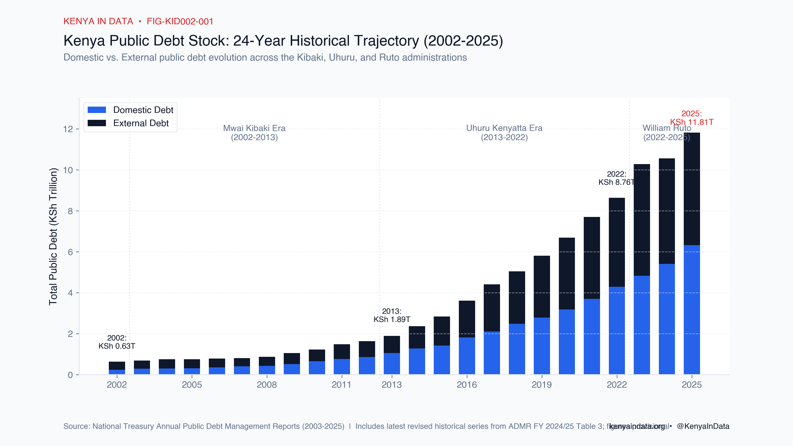
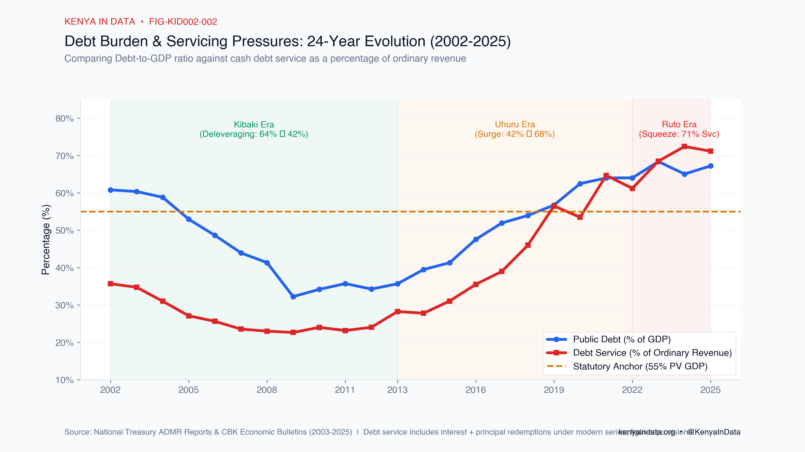
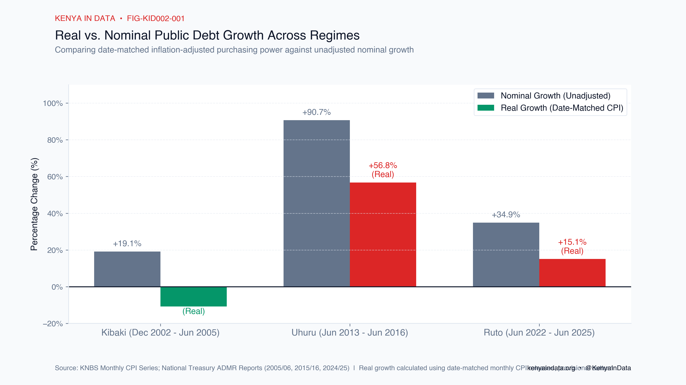
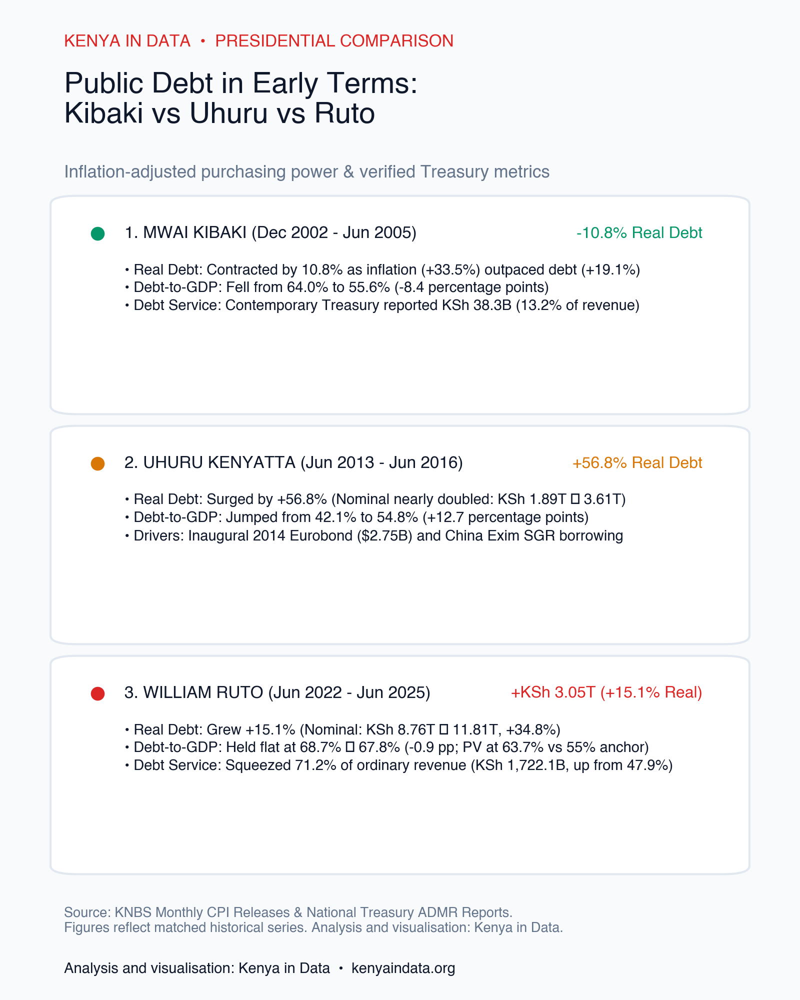

# Kenya's Public Debt: A 24-Year Historical Analysis (2002–2026)

*A comprehensive, source-grounded and inflation-adjusted analysis of how Kenya's public debt stock, debt composition, debt-to-GDP ratio, and debt-servicing burden evolved across three presidential transitions over nearly a quarter century.*

<!-- Canonical publication document: every chart, caption, social post, infographic, PDF, deck, and interactive widget in KID-002 is derived from this document. -->

---

## Executive Summary & 24-Year Overview

Over the last 24 years (June 2002 to May 2026), Kenya's public debt expanded from **KSh 629.5 billion to KSh 12.896 trillion** in nominal terms. However, analyzing this trajectory solely through unadjusted nominal shillings obscures the fundamental economic shifts across Kenya's three presidential administrations:

1. **The Mwai Kibaki Era (2002–2013): Fiscal Consolidation & Deleveraging**  
   Nominal debt increased from KSh 629.5 billion (December 2002) to KSh 1.894 trillion (June 2013). Because tax revenue collection expanded by **+324%** and economic growth outpaced new borrowing, Kenya underwent a sustained deleveraging cycle: the **Debt-to-GDP ratio fell from 64.0% down to 42.1%** (and bottomed at 32.2% in 2009).
2. **The Uhuru Kenyatta Era (2013–2022): Infrastructure Expansion & Commercial Debt**  
   Nominal debt quadrupled from KSh 1.894 trillion to KSh 8.761 trillion (+362.5%), representing a **+136.9% increase in real purchasing power**. Driven by commercial Eurobonds (USD 2.75B debut in 2014, followed by 2018, 2019, 2021 issuances) and bilateral China Exim Bank loans for the Standard Gauge Railway (SGR), **Debt-to-GDP climbed from 42.1% to 68.7%**.
3. **The William Ruto Era (2022–2026): The Domestic Interest Trap & Fiscal Squeeze**  
   Nominal debt rose by KSh 3.053 trillion to reach KSh 11.814 trillion by June 2025 (and KSh 12.896 trillion by May 2026). While nominal Debt-to-GDP held roughly flat (**68.7% ➔ 67.8%**), the critical crisis emerged in **cash debt service**, which exploded from **47.9% of ordinary revenue in FY 2021/22 to 71.2% in FY 2024/25 (KSh 1.722 trillion)**, driven by a **13.0% weighted average interest rate** on domestic Treasury bonds.

*Figure 1. 24-Year evolution of Kenya's public debt stock (2002–2025). Data: National Treasury Annual Public Debt Management Reports (2003–2025; latest revised historical series from ADMR FY 2024/25 Table 3). Analysis and visualisation: Kenya in Data.*

---

## 24-Year Master Historical Table (FY 2001/02 – FY 2024/25)

| Fiscal Year | Calendar Year | Administration | Domestic Debt (KSh B) | External Debt (KSh B) | Total Public Debt (KSh B) | Debt (% of GDP) | Ordinary Revenue (KSh B) | Total Debt Service (KSh B) | Debt Service / Revenue (%) |
|:---:|:---:|:---|---:|---:|---:|---:|---:|---:|---:|
| **FY 2001/02** | 2002 | Moi / Transition | 236.4 | 393.1 | **629.5** | 60.8% | 183.4 | 65.4 | 35.7% |
| **FY 2002/03** | 2003 | Kibaki I (Inauguration) | 288.6 | 394.4 | **683.0** | 60.4% | 205.8 | 71.5 | 34.7% |
| **FY 2004/05** | 2005 | Kibaki I (Year 3) | 315.6 | 434.0 | **750.0** | 55.6% | 274.3 | 74.3 | 27.1% |
| **FY 2007/08** | 2008 | Kibaki II | 430.6 | 440.0 | **870.6** | 41.3% | 416.7 | 95.8 | 23.0% |
| **FY 2008/09** | 2009 | Kibaki II | 518.3 | 537.9 | **1,056.2** | 32.2% | 480.6 | 108.8 | 22.6% |
| **FY 2012/13** | 2013 | Kibaki ➔ Uhuru Handover | 1,050.6 | 843.7 | **1,894.1** | 42.1% | 778.6 | 219.9 | 28.2% |
| **FY 2013/14** | 2014 | Uhuru I (Eurobond Debut) | 1,284.3 | 1,086.0 | **2,370.3** | 39.5% | 918.9 | 255.4 | 27.8% |
| **FY 2015/16** | 2016 | Uhuru I (Year 3) | 1,815.1 | 1,796.2 | **3,611.3** | 54.8% | 1,152.9 | 409.3 | 35.5% |
| **FY 2018/19** | 2019 | Uhuru II | 2,785.9 | 3,023.2 | **5,809.1** | 56.7% | 1,499.8 | 847.4 | 56.5% |
| **FY 2021/22** | 2022 | Uhuru ➔ Ruto Handover | 4,288.3 | 4,472.7 | **8,761.0** | 68.7% | 1,917.8 | 1,173.6 | 47.9% |
| **FY 2022/23** | 2023 | Ruto (Year 1) | 4,832.1 | 5,446.6 | **10,278.7** | 68.4% | 2,041.1 | 1,397.9 | 68.5% |
| **FY 2024/25** | 2025 | Ruto (Year 3) | 6,326.0 | 5,488.5 | **11,814.5** | 67.8% | 2,420.2 | 1,722.1 | **71.2%** |

*Table 1. Selected benchmark years from the 24-year Kenya in Data historical database. Sources: National Treasury ADMR Reports 2003–2025; CBK Economic Bulletins; KNBS Economic Surveys.*

---

## 1. The 24-Year Trajectory: Three Distinct Fiscal Regimes

*Figure 2. Debt burden and servicing pressures (2002–2025). The blue line tracks the Debt-to-GDP ratio; the red line tracks debt service as a percentage of ordinary revenue. Data: National Treasury ADMR Reports. Analysis and visualisation: Kenya in Data.*

### Phase 1: Mwai Kibaki (2002–2013) — Economic Growth Outpaces Debt
- **Starting Point:** December 2002 debt stood at **KSh 629.5 billion (64.0% of GDP)**, inheriting an economy constrained by low tax yields and stalled donor programs.
- **The Strategy:** The administration prioritized domestic revenue mobilization, establishing structured collection reforms that increased ordinary revenue from KSh 183.4 billion in FY 2001/02 to KSh 778.6 billion in FY 2012/13 (+324%).
- **The Outcome:** Because nominal GDP grew by **+413%** (expanding from KSh 1.035T to KSh 5.311T), **Debt-to-GDP plummeted from 64.0% to 42.1%**. External debt was overwhelmingly multilateral and concessional (World Bank IDA and AfDB), keeping debt servicing at a sustainable **22%–28% of ordinary revenue**.

### Phase 2: Uhuru Kenyatta (2013–2022) — The Mega-Infrastructure & Commercial Era
- **Starting Point:** Inherited a low debt-to-GDP baseline of **42.1%** and access to international capital markets following Kenya's 2014 sovereign credit rating and GDP rebasing.
- **The Strategy:** Shifted aggressively into international capital markets and bilateral project finance:
  - **Commercial Eurobonds:** Kenya issued its debut USD 2.75 billion Eurobond in 2014, followed by USD 2.0 billion in 2018, USD 2.1 billion in 2019, and USD 1.0 billion in 2021.
  - **China Exim Bank Loans:** Financed the Mombasa–Nairobi and Nairobi–Naivasha Standard Gauge Railway (SGR) with over USD 5.0 billion in bilateral debt facilities.
  - **Syndicated Commercial Loans:** Contracted commercial bank loans with floating interest rates.
- **The Outcome:** Nominal debt surged from KSh 1.894 trillion to **KSh 8.761 trillion** (latest revised series). Debt-to-GDP climbed by **+26.6 percentage points to 68.7%**, while debt servicing rose from 28.2% to **47.9% of ordinary revenue**.

### Phase 3: William Ruto (2022–2026) — The Liquidity Crisis & Domestic Yield Squeeze
- **Starting Point:** Assumed office with public debt at **KSh 8.761 trillion (68.7% of GDP)**, an impending USD 2.0 billion 2014 Eurobond maturity (due June 2024), and global credit markets largely closed to frontier economies.
- **The Strategy:** Refinanced external debt through IMF/World Bank development policy operations and a 2024 Eurobond buyback, while relying heavily on domestic Treasury bonds to finance budget deficits.
- **The Outcome:** Nominal debt reached **KSh 11.814 trillion (June 2025)** and **KSh 12.896 trillion (May 2026)**. While nominal GDP growth kept Debt-to-GDP roughly flat (**68.7% ➔ 67.8%**), the fiscal cost of borrowing exploded:
  - **Debt Service reached 71.2% of ordinary revenue (KSh 1.722 trillion)** in FY 2024/25.
  - **The Domestic Yield Burden:** Domestic Treasury bonds carried a **13.0% weighted average interest rate** (vs 3.9% on external loans), meaning domestic interest alone consumed **32.1% of all ordinary revenue (KSh 776.3 billion)**.

---

## 2. Comparative Deep-Dive: The First Three Years Across Presidencies

To assess presidential fiscal management fairly, public debate often focuses on the **early-term accession window** (the first ~2.5 to 3 years of each presidency). 

### Why Raw Percentage Comparisons Mislead
Popular commentary often asserts that *"debt grew 300% under Kibaki, 500% under Uhuru, and 27% under Ruto."* These comparisons suffer from severe methodological fallacies:
1. **The Base Effect:** Adding KSh 1.2 trillion onto a small base of KSh 630 billion produces a huge percentage growth (+190%), yet debt remains low relative to the economy. Adding KSh 3.05 trillion onto an KSh 8.76 trillion base produces a smaller percentage (+35%), yet adds more than double the volume of shillings into the debt register.
2. **Inflation Distortion:** A shilling in 2002 had over 5 times the purchasing power of a shilling in 2024. Without adjusting for the Consumer Price Index (CPI), historical comparisons conflate monetary inflation with real borrowing expansion.
3. **Debt Stock vs. Cash Servicing:** A country can maintain a stable Debt-to-GDP ratio while facing fiscal insolvency if cash interest payments consume all available revenue.

---

### Head-to-Head 3-Year Comparison Table

| Presidential Administration | Observation Window | Starting Debt (Nominal) | End Debt (Nominal) | Nominal Growth | Real Debt Growth (Date-Matched CPI)* | Debt-to-GDP Movement | Debt Service / Revenue (%) |
|---|:---:|---:|---:|:---:|:---:|:---:|:---:|
| **Mwai Kibaki** | Dec 2002 ➔ Jun 2005 (~2.5 Yrs) | KSh 629.5B | KSh 750.0B | **+19.1%** | 📉 **-10.8%** | **64.0% ➔ 55.6%** *(-8.4 pp)* | 35.7% ➔ **27.1%** *(13.2% contemporary)* |
| **Uhuru Kenyatta** | Jun 2013 ➔ Jun 2016 (3 Yrs) | KSh 1,894.1B | KSh 3,611.3B | **+90.7%** | 📈 **+56.8%** | **42.1% ➔ 54.8%** *(+12.7 pp)* | 28.2% ➔ **35.5%** *(21.7% contemporary)* |
| **William Ruto** | Jun 2022 ➔ Jun 2025 (3 Yrs) | KSh 8,761.0B | KSh 11,814.5B | **+34.8%** | 📈 **+15.1%** | **68.7% ➔ 67.8%** *(-0.9 pp)* | 47.9% ➔ **71.2%** *(Historic Squeeze)* |

*Figure 3. Early-term presidential comparison. Real growth calculated via date-matched monthly CPI releases from KNBS. Sources: National Treasury ADMR Reports; Bunge Library Historical Records.*

*Figure 3. Real (CPI deflated) vs Nominal public debt growth during the early-term windows of each administration. Analysis and visualisation: Kenya in Data.*

---

## 3. Early-Term Findings by Administration

### A. Mwai Kibaki (Dec 2002 – Jun 2005): Real Contraction & Deleveraging
- **The Numbers:** Starting debt at accession (Dec 2002) was **KSh 629.5 billion (64.0% of GDP)**. By June 2005, nominal debt reached **KSh 750.0 billion (+19.1%)**.
- **The Inflation Reality:** Because consumer prices rose by +33.5% (KNBS CPI rising from 136.7 to 182.5), **real debt contracted by 10.8% in constant purchasing power**.
- **Deleveraging:** Nominal GDP expanded by **+36.7%**, driving the **Debt-to-GDP ratio down from 64.0% to 55.6% (-8.4 percentage points)**.
- **Servicing:** Contemporary reports recorded debt service at **KSh 38.35 billion (13.2% of revenue)** under external-only definitions, or **27.1%** under total debt service.

### B. Uhuru Kenyatta (Jun 2013 – Jun 2016): The Commercial Debt Surge
- **The Numbers:** Nominal debt nearly doubled from **KSh 1.894 trillion to KSh 3.611 trillion (+90.7%)**.
- **The Inflation Reality:** Accounting for +21.6% inflation, **real purchasing-power debt expanded by +56.8%**—the fastest real borrowing surge among the three windows.
- **GDP Ratio Jump:** Debt-to-GDP increased by **+12.7 percentage points (42.1% ➔ 54.8%)**.
- **Drivers:** The June 2014 debut Eurobond (USD 2.75 billion) and initial disbursements from China Exim Bank for the Mombasa–Nairobi SGR project.

### C. William Ruto (Jun 2022 – Jun 2025): Record Shillings & The Liquidity Squeeze
- **The Numbers:** On the National Treasury's latest revised series, debt grew from **KSh 8.761 trillion to KSh 11.814 trillion (+KSh 3.053 trillion nominal, +34.8%)**.
- **The Inflation Reality:** Deflated by date-matched CPI (+17.2% inflation), **real debt grew by +15.1%**.
- **Debt-to-GDP Held Flat:** Because nominal GDP expanded from KSh 12.76T to KSh 17.43T, Debt-to-GDP moved from **68.7% to 67.8% (-0.9 pp)**. Present Value debt was reported at **63.7% of GDP** (8.7 pp above the 55% statutory anchor).
- **The True Crisis (Debt Servicing):** Debt service exploded from **47.9% of ordinary revenue in FY 2021/22 to 71.2% in FY 2024/25 (KSh 1.722 trillion)**. Total interest consumed **40.8% of ordinary revenue (KSh 987.5 billion)**, with domestic interest alone eating **32.1% (KSh 776.3 billion)** at a **13.0% weighted average interest rate**.

---

## 4. Summary Infographic

*Figure 4. Summary comparison card of early-term presidential trajectories. Analysis and visualisation: Kenya in Data.*

---

## 5. Methodological Notes & Deflator Formulas

### 1. CPI Deflation Formula
To compute real debt growth in constant purchasing power, nominal debt figures are adjusted using date-matched monthly Consumer Price Index (CPI) releases from KNBS:
$$\text{Real Growth} = \left( \frac{\text{Nominal Debt}_{t_1}}{\text{Nominal Debt}_{t_0}} \times \frac{\text{CPI}_{t_0}}{\text{CPI}_{t_1}} \right) - 1$$

- **Kibaki Window (Dec 2002 ➔ Jun 2005):** $\frac{750.025}{629.500} \times \frac{136.70}{182.50} - 1 = -10.76\%$
- **Uhuru Window (Jun 2013 ➔ Jun 2016):** $\frac{3611.331}{1894.117} \times \frac{139.59}{169.76} - 1 = +56.77\%$
- **Ruto Window (Jun 2022 ➔ Jun 2025):** $\frac{11814.474}{8761.000} \times \frac{124.22}{145.58} - 1 = +15.06\%$

### 2. Statutory Anchor (PFM Act §50)
Kenya's Public Finance Management (PFM) Act anchors public debt at **55% of GDP in Present Value (PV) terms**. At June 2025, nominal debt was 67.8% of GDP and PV debt was **63.7% of GDP** (exceeding the statutory anchor by 8.7 percentage points).

### 3. Ordinary Revenue Definition
Ordinary revenue represents recurrent tax revenue and non-tax revenue collected by the National Government as reported in National Treasury fiscal outturns.

---

## 6. Glossary

| Term | Technical & Plain-Language Definition |
|---|---|
| **Nominal Debt** | The unadjusted face value of total debt stock in current Kenya Shillings. |
| **Real Debt** | The inflation-adjusted debt stock reflecting constant purchasing power. |
| **Base Effect** | The statistical artifact where equal absolute changes produce wildly different percentage changes depending on the baseline size. |
| **Debt Service Absorption** | The proportion of ordinary revenue consumed by interest and principal repayments. |
| **Present Value (PV) Debt** | The discounted sum of future debt service flows, used to evaluate debt sustainability under concessional terms. |
| **Weighted Average Interest Rate (WAIR)** | The effective aggregate interest rate paid across a debt portfolio, weighted by loan size. |
