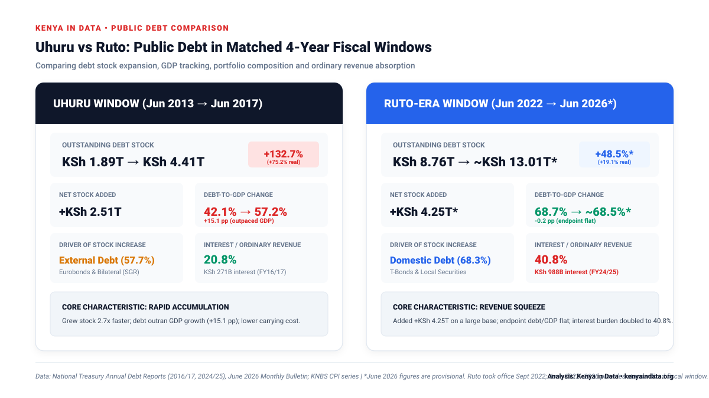
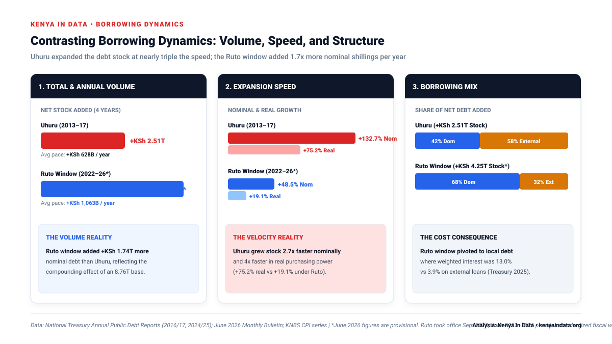
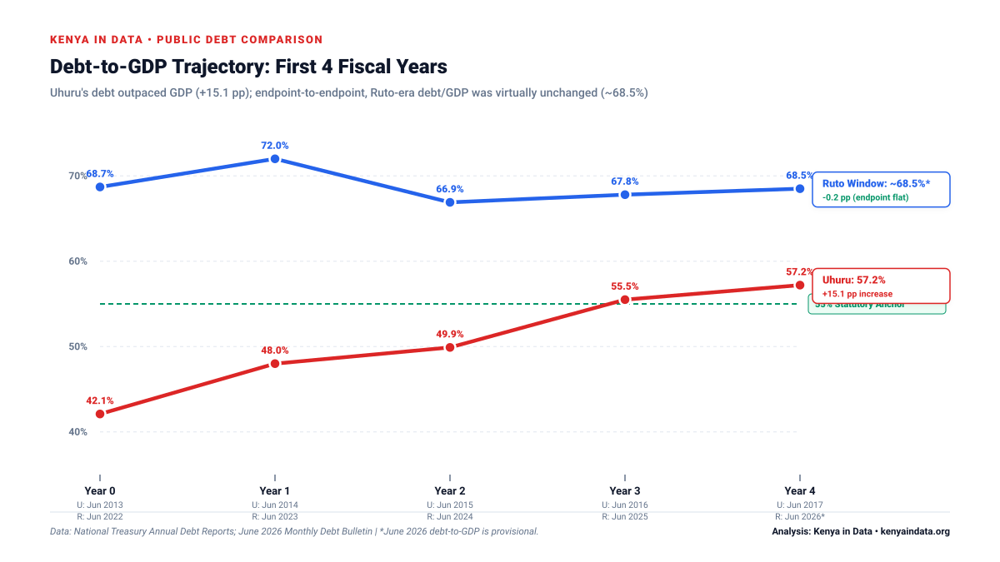
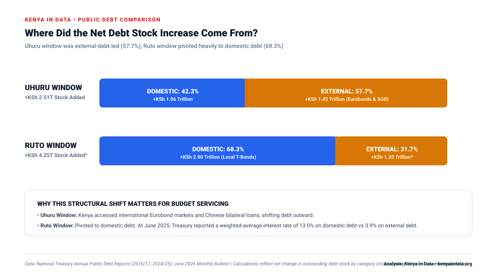
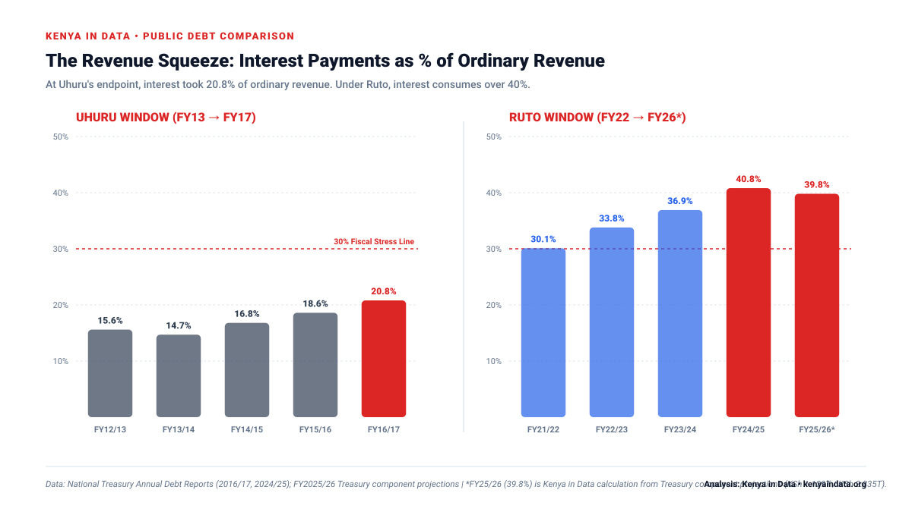

# Uhuru vs Ruto: Kenya's Public Debt in Their First Four Fiscal-Year Windows

*How did Kenya's public debt evolve during the first four comparable fiscal-year windows of the Uhuru Kenyatta and William Ruto administrations? A head-to-head empirical comparison of debt growth, inflation-adjusted expansion, GDP tracking, debt composition and the burden of debt servicing.*

---

## Key findings

- **Debt Stock Expansion:** Under the Uhuru Kenyatta comparison window (June 2013 → June 2017), the outstanding public debt stock more than doubled, rising from **KSh 1.894 trillion to KSh 4.407 trillion (+132.7% nominal, +75.2% real)**. The June 2022–June 2026 Ruto-era fiscal window recorded a public debt rise from **KSh 8.761 trillion to a provisional KSh 13.013 trillion (+48.5% nominal, +19.1% real)**.
- **Absolute Shillings Added:** The Ruto-era window recorded a larger nominal increase in the outstanding stock (**+KSh 4.252 trillion**) than the Uhuru window (**+KSh 2.513 trillion**), reflecting the larger starting base inherited in 2022.
- **Debt-to-GDP Trajectory:** Under Uhuru, debt expanded substantially faster than the economy, rising by **+15.1 percentage points** (from 42.1% to 57.2% of GDP). Across the Ruto-era window, endpoint-to-endpoint debt/GDP was virtually unchanged (**68.7% in June 2022 versus ~68.5% in June 2026**).
- **Driver of the Net Debt Stock Increase:** The net increase in the debt stock under Uhuru was driven by external debt (**57.7% of the total increase**, including Kenya's debut 2014 Eurobond and bilateral SGR financing). In the Ruto window, the net increase was driven heavily by domestic debt (**68.3% of the total increase**).
- **The Cash-Servicing Burden:** In FY2016/17 (Uhuru endpoint), total interest payments consumed **20.8% of ordinary revenue**. In FY2024/25 (Ruto), interest payments absorbed **40.8% of ordinary revenue**—doubling the carrying cost on the national budget.

---

## The short answer

A matched four-year fiscal comparison reveals two very different debt trajectories.

Under **Uhuru Kenyatta**, public debt increased from **KSh 1.894 trillion in June 2013 to KSh 4.407 trillion in June 2017**. The outstanding debt stock therefore more than doubled, increasing by **KSh 2.513 trillion, or 132.7%**. Adjusting for consumer-price inflation, the increase was approximately **75.2% in real purchasing-power terms**. Over the same period, debt-to-GDP rose sharply from **42.1% to 57.2%**, a deterioration of **15.1 percentage points** (National Treasury, 2017, Table 1-2).

For **William Ruto**, the corresponding standardized fiscal window begins with the National Treasury's revised June 2022 debt stock of **KSh 8.761 trillion**. By June 2025, debt had reached KSh 11.814 trillion; the Treasury's June 2026 Monthly Debt Bulletin subsequently put the provisional stock at approximately **KSh 13.013 trillion**. That represents a four-year increase in the debt stock of roughly **KSh 4.252 trillion, or 48.5% nominally**. After inflation, the increase is approximately **19.1%**. Endpoint-to-endpoint, debt-to-GDP was virtually unchanged: **68.7% in June 2022 versus approximately 68.5% in June 2026**.

The resulting headline is nuanced:

> **The Ruto-era fiscal window recorded considerably more shillings added to the outstanding debt stock (+KSh 4.25T vs +KSh 2.51T), but Uhuru's debt stock grew almost three times as fast relative to the base he inherited (+132.7% vs +48.5%). Under Uhuru, debt outpaced economic growth; under the Ruto window, debt-to-GDP was virtually unchanged endpoint-to-endpoint. However, Ruto inherited a massive debt pile where interest alone now consumes over 40% of ordinary revenue.**

---

## Head-to-head: Four-year fiscal windows

| Metric | Uhuru Window (Jun 2013 → Jun 2017) | Ruto-Era Window (Jun 2022 → Jun 2026*) | Analytical Takeaway |
|---|---:|---:|---|
| **Comparison window** | Jun 2013 → Jun 2017 | Jun 2022 → Jun 2026* | Standardized 4-year June fiscal windows |
| **Starting public debt** | **KSh 1.894T** | **KSh 8.761T** | Ruto window began from a 4.6× larger base |
| **Ending public debt** | **KSh 4.407T** | **~KSh 13.013T*** | Outstanding public & guaranteed debt |
| **Increase in debt stock** | **+KSh 2.513T** | **+KSh 4.252T** | **Ruto window added +KSh 1.74T more nominal stock** |
| **Nominal debt growth** | **+132.7%** | **+48.5%** | **Uhuru grew the stock 2.7× faster** |
| **CPI-adjusted real growth** | **+75.2%** | **+19.1%** | Inflation-adjusted purchasing power |
| **Starting debt/GDP** | **42.1%** | **68.7%** | Base debt-to-GDP position |
| **Ending debt/GDP** | **57.2%** | **~68.5%*** | Post-window debt ratio |
| **Change in debt/GDP** | **+15.1 pp** | **~-0.2 pp*** | **Uhuru outpaced GDP; Ruto window endpoint flat** |
| **Domestic debt added** | +KSh 1.062T (42.3%) | +KSh 2.903T (68.3%) | Ruto window pivoted to local Treasury bonds |
| **External debt added** | +KSh 1.451T (57.7%) | +KSh 1.349T (31.7%) | Uhuru expansion led by Eurobonds & SGR |
| **Interest / Ordinary revenue** | **20.8%** (FY16/17) | **40.8%** (FY24/25) | **Carrying cost doubled in current era** |
| **Like-for-like service ratio** | **23.6%** | **~56.0%** | Interest + External Principal / Ordinary Revenue |

*\*June 2026 figures are provisional. Sources: National Treasury Annual Public Debt Management Reports (2016/17, 2024/25), June 2026 Monthly Debt Bulletin; KNBS CPI series. Calculations: Kenya in Data.*

*Figure 1. Kenya in Data Head-to-Head Public Debt Scorecard: Uhuru Window (2013–2017) vs Ruto-Era Window (2022–2026). Data: National Treasury and KNBS. Analysis: Kenya in Data.*

---

## 1. Debt stock: Uhuru grew it faster; Ruto window added more shillings

The most obvious difference is the base from which the two administrations began.

Uhuru's comparison window starts with a public debt stock of **KSh 1.894 trillion**. Four fiscal years later, that stock stood at **KSh 4.407 trillion**. The increase was therefore KSh 2.513 trillion, equivalent to **132.7%**. Put differently, the debt stock at the end of the window was **2.33 times** its starting level.

The Ruto-era comparison window began from a dramatically larger base. The latest Treasury historical series places public debt at **KSh 8.761 trillion in June 2022**. The June 2026 Monthly Debt Bulletin puts the provisional end-June 2026 stock at approximately **KSh 13.013 trillion**. The increase in the outstanding stock is therefore about KSh 4.252 trillion, or **48.5%** (a 1.49× expansion).

This distinction illustrates the base effect:

- The outstanding debt stock in the Ruto-era window increased by roughly **KSh 1.74 trillion more** than during the comparable Uhuru window.
- But because the Ruto window began from a debt stock already more than four times as large, the percentage increase was much smaller.

This is why statements such as *"one president borrowed X percent while another borrowed Y percent"* are incomplete without examining both the starting base and the absolute change.

There is also an accounting distinction worth preserving: **the increase in outstanding debt stock is not identical to gross or net new borrowing.** Governments simultaneously issue new debt, repay maturing obligations, refinance existing loans and experience valuation changes on foreign-currency debt. The figures here measure the **net change in the stock of outstanding public debt**, not every gross shilling disbursed.

*Figure 2. Public Debt Stock: Starting Base, Net Added, and Ending Total. Comparing the inherited base and net additions over the 4-year windows (KSh Trillions). Data: National Treasury. Analysis: Kenya in Data.*

*Figure 3. Contrasting Borrowing Dynamics: Comparing Total & Annual Shillings Added, Expansion Velocity (Nominal & Real), and Domestic vs External Portfolio Structure. Data: National Treasury and KNBS. Analysis: Kenya in Data.*

---

## 2. After inflation, the growth gap widens

Nominal shillings in 2013 and 2026 do not have the same purchasing power. To compare the economic scale of debt accumulation, the debt stocks can be deflated using date-matched KNBS Consumer Price Index observations.

KNBS reported CPI of **139.59 in June 2013** and **185.39 in June 2017** (2009=100 base). Applying those indices to the change in Uhuru's nominal debt stock gives real debt growth of approximately **75.2%**.

For the Ruto window, the CPI was **124.22 in June 2022** and **154.91 in June 2026** (2019=100 base). The resulting inflation-adjusted increase in the debt stock is approximately **19.1%**.

Thus:
- **Uhuru Kenyatta (2013–2017):** +132.7% nominal → **+75.2% real growth**
- **William Ruto Window (2022–2026):** +48.5% nominal → **+19.1% real growth**

The inflation adjustment shows that the real purchasing-power expansion of the debt stock during Uhuru's first four-year fiscal window was approximately **four times** the corresponding real increase recorded during the Ruto window.

*Figure 4. Normalized Public Debt Trajectory (Year 0 = 100). Comparing nominal and real debt growth trajectories across the first four fiscal years of each administration. Data: National Treasury and KNBS. Analysis: Kenya in Data.*

---

## 3. Debt relative to the economy: Outpacing output vs holding the line

Debt becomes far more meaningful when compared with the size of the national economy supporting it.

In June 2013, Kenya's public debt was equivalent to **42.1% of GDP**. By June 2017, the ratio had risen to **57.2%**. That is an increase of **15.1 percentage points in only four fiscal years**. Treasury historical tables show nominal GDP increasing from KSh 4.496 trillion to KSh 7.711 trillion over the period, while debt increased from KSh 1.894 trillion to KSh 4.407 trillion. Debt therefore accumulated considerably faster than economic output.

Under the Ruto window, the trajectory is different. Treasury's revised series reports public debt equal to **68.7% of GDP in June 2022**. The provisional June 2026 bulletin places the ratio at approximately **68.5%**. Endpoint-to-endpoint, debt/GDP was virtually unchanged across the window, moving along an intermediate path: **68.7% in FY2021/22 → 72.0% in FY2022/23 → 66.9% in FY2023/24 → 67.8% in FY2024/25 → ~68.5% in June 2026**.

This does not mean Kenya's debt vulnerability has disappeared. It establishes a specific structural fact: **nominal GDP has broadly kept pace with the growth of the outstanding debt stock over the last four years**, whereas under Uhuru's first four years, debt grew significantly faster than the economy.

*Figure 5. Debt-to-GDP Trajectories in the First Four Fiscal Years. Dotted line marks the 55% statutory anchor. Data: National Treasury Annual Debt Reports and June 2026 Monthly Bulletin. Analysis: Kenya in Data.*

---

## 4. The composition of debt: External financing vs domestic paper

The structural composition of the net increase in the debt stock also diverged significantly between the two periods.

Under Uhuru (June 2013 → June 2017):
- Domestic public debt increased from **KSh 1.051 trillion to KSh 2.113 trillion** (+KSh 1.062 trillion).
- External debt increased from **KSh 843.6 billion to KSh 2.294 trillion** (+KSh 1.451 trillion).
- External debt accounted for **57.7% of the net increase in the debt stock**, raising external debt from 44.5% to 52.1% of total debt. This reflected Kenya's debut 2014 sovereign Eurobond and major bilateral infrastructure project financing (such as the Standard Gauge Railway).

Across the Ruto window (June 2022 → June 2026 provisional):
- In June 2022, debt was split almost evenly: **KSh 4.427 trillion domestic** vs **KSh 4.335 trillion external**.
- By June 2026 (provisional), domestic debt reached roughly **KSh 7.33 trillion** (56.3% of total) versus **KSh 5.68 trillion external**.
- Domestic debt accounted for **68.3% of the net increase in the debt stock** (+KSh 2.903 trillion out of +KSh 4.252 trillion).

*Figure 6. Breakdown of the Net Increase in the Public Debt Stock by Category. Data: National Treasury Annual Public Debt Reports. Analysis: Kenya in Data.*

This composition shift is critical for debt sustainability: **at June 2025, Treasury reported a weighted-average interest rate of 13.0% on domestic debt versus 3.9% on external debt.** Shifting the balance of new debt accumulation toward domestic securities has significantly elevated the budget's cash carrying costs.

---

## 5. The repayment burden: Ruto's defining fiscal challenge

A comparison based solely on the debt stock makes the Ruto period appear more favorable. Examining debt servicing fundamentally alters that conclusion.

There is, however, an important statistical distinction: **the National Treasury changed how headline "total debt service" is defined across reporting periods.**

- In the FY2016/17 report, Treasury's headline debt service consisted of **external principal repayments + external interest + domestic interest** (excluding domestic bond redemptions). This totalled KSh 308.5 billion, or **23.6% of ordinary revenue**.
- Modern Treasury reports include **domestic Treasury-bond principal redemptions as well**, pushing the published FY2024/25 headline debt-service ratio to **71.2% of ordinary revenue** (KSh 1.722 trillion).

Simply placing **23.6% beside 71.2%** is misleading due to the changed accounting perimeter.

A consistent, like-for-like metric across both periods is the **interest burden**, because interest payments can be reconstructed identically:

| Debt-servicing measure | Uhuru FY2016/17 | Ruto FY2024/25 Actual | Ruto FY2025/26 Projection* |
|---|---:|---:|---:|
| **Total interest paid** | **KSh 271.2B** | **KSh 987.5B** | **KSh 1.129T** |
| **Ordinary revenue collected** | **KSh 1.306T** | **KSh 2.420T** | **KSh 2.835T** |
| **Interest / Ordinary revenue** | **20.8%** | **40.8%** | **~39.8%** |
| **Like-for-like debt service (Interest + Ext. Principal)** | **23.6%** | **~56.0%** | **~56.7%** |
| **Modern headline service ratio** | *Not directly comparable* | **71.2%** | **73.0% projected** |

*\*Kenya in Data calculations from National Treasury tables. Note on FY2025/26: In Table 11.1-1 of the FY2024/25 Annual Public Debt Report, Treasury reports projected domestic interest/revenue as 30.0% and external interest/revenue as 9.8%, but misprints the summary total row as 16.3%. Reconstructed accurately from projected interest (KSh 1.1294T) and ordinary revenue (KSh 2.8350T), total interest/revenue is 39.8%.*

*Figure 7. The Revenue Squeeze: Interest Payments as a Share of Ordinary Revenue. Data: National Treasury. Analysis: Kenya in Data.*

At the end of Uhuru's four-year fiscal window, interest payments absorbed **20.8% of ordinary revenue**. By FY2024/25 under Ruto, interest payments reached **40.8%**—nearly double the Uhuru endpoint.

This is the central fiscal constraint of the present era:

> **The debt stock has grown much more slowly relative to GDP across the Ruto window than it did under Uhuru, but Ruto governs with a much larger inherited balance sheet carrying a far heavier cash-servicing burden.**

---

## 6. Conclusion: Two administrations, two different debt problems

The answer to which administration performed "better" on debt depends entirely on the metric evaluated:

1. **On Debt Accumulation Speed:** Uhuru's first four years were far more aggressive (**+132.7% nominal, +75.2% real**) than the Ruto window (**+48.5% nominal, +19.1% real**).
2. **On Nominal Shillings Added:** The Ruto-era window recorded a larger increase in nominal liabilities (**+KSh 4.25 trillion**) than the Uhuru window (**+KSh 2.51 trillion**), driven by base-size mechanics.
3. **On Macroeconomic Output:** Uhuru's borrowing ran significantly ahead of the economy (**debt/GDP +15.1 pp**), whereas across the Ruto window, endpoint-to-endpoint debt/GDP was virtually unchanged (**flat at ~68.5%**).
4. **On Cash Affordability & Revenue Strain:** The current environment is far more distressed, with interest alone consuming **40.8% of ordinary revenue** compared to **20.8%** at the end of Uhuru's first four years.

In summary:
- **Uhuru Kenyatta's first four years were a Debt-Accumulation Problem:** the stock expanded rapidly, heavily driven by external borrowing, including commercial Eurobonds and bilateral infrastructure financing such as the SGR, significantly outpacing economic growth.
- **William Ruto's first four years are a Debt-Carrying-Cost Problem:** the stock grew more slowly relative to GDP, but sits atop a massive inherited base where domestic borrowing and high interest rates consume more than four out of every ten shillings of ordinary revenue.

---

## Methodology

This analysis uses matched **June-to-June fiscal-year debt-stock windows** rather than presidential swearing-in anniversaries. Uhuru Kenyatta assumed office in April 2013; William Ruto assumed office in September 2022. Because Ruto took office in September 2022, roughly the first 2½ months of the FY2022/23 baseline precede his presidency. June 2013 → June 2017 and June 2022 → June 2026 provide standardized four-year fiscal accounting snapshots.

- **Data Sources:** For Uhuru, figures are sourced from the National Treasury *Annual Public Debt Management Report 2016/17* (Table 1-2). For Ruto, figures are sourced from the *Annual Public Debt Report 2024/25* (Tables 4.0-1 and 11.1-1) and the provisional *June 2026 Monthly Debt Bulletin*.
- **Inflation Adjustment Formula:** Real growth is computed using KNBS monthly CPI series:
  $$\text{Real Growth} = \left(\frac{\text{Debt}_{\text{end}}}{\text{Debt}_{\text{start}}}\right) \times \left(\frac{\text{CPI}_{\text{start}}}{\text{CPI}_{\text{end}}}\right) - 1$$
  Uhuru calculations use the February 2009=100 CPI series (June 2013: 139.59, June 2017: 185.39). Ruto calculations use the February 2019=100 series (June 2022: 124.22, June 2026: 154.91).
- **Accounting Scope:** Figures reflect net outstanding public and publicly guaranteed debt stock, which incorporates new disbursements, repayments, amortizations and exchange-rate valuation changes.

---

## Primary source references

1. Republic of Kenya, National Treasury. (2017). *Annual Public Debt Management Report 2016/2017*. Tables 1-2, 1-3, pp. 12–18.
2. Republic of Kenya, National Treasury and Economic Planning. (2025). *Annual Public Debt Report 2024/2025*. Tables 4.0-1, 4.1-1 and 11.1-1, pp. 28–45.
3. Republic of Kenya, National Treasury and Economic Planning. (2026). *June 2026 Monthly Debt Bulletin*. Public Debt Management Office.
4. Kenya National Bureau of Statistics. (2013–2017). *Consumer Price Indices and Inflation Rates*, June observations (Base Feb 2009=100).
5. Kenya National Bureau of Statistics. (2022–2026). *Consumer Price Indices and Inflation Rates*, June observations (Base Feb 2019=100).