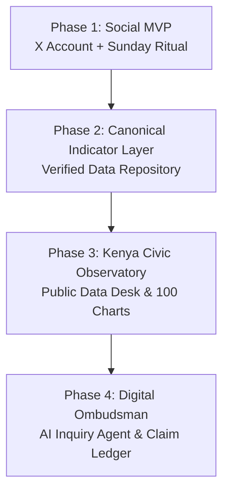

# Kenya in Data Roadmap

---

## Phase 1: The Social Publication Engine (MVP — Weeks 1 to 8)
**Goal:** Build public credibility, establish visual brand recognition on X/LinkedIn, and train the weekly publishing muscle.

- [x] Define vault structure and operating model.
- [ ] Establish visual style guide & Python chart generator template.
- [ ] Publish Flagship Graphic **#001**: The Kenyan Shilling (2000–2026).
- [ ] Publish Flagship Graphic **#002**: Public Debt Across Presidencies (Nominal vs. Real vs. % of GDP).
- [ ] Establish fixed **Sunday Output Routine** (2–3 hours weekly block).
- [ ] Publish first 10 foundational graphics:
  1. `#001` The Shilling (KES/USD 2000–2026)
  2. `#002` Public Debt Stock & Deflators
  3. `#003` Where Your KSh 100 Goes (National Budget Breakdown)
  4. `#004` Debt Service as % of Revenue (2005–2026)
  5. `#005` The Price of Unga & Food Inflation Basket
  6. `#006` Real vs Nominal GDP Per Capita
  7. `#007` The Shilling Under Every Administration
  8. `#008` Tax Revenue as % of GDP
  9. `#009` County Development Spending Absorption Ranking
  10. `#010` Voter Registration vs Turnout Trends

---

## Phase 2: Canonical Indicator Layer (Months 2 to 4)
**Goal:** Transition from ad-hoc charts to a standardized, machine-readable indicator repository.

- [ ] Ingest long-run time series into `Data/raw/` and `Data/processed/` for 50 core indicators.
- [ ] Build automated scrapers/monitors for KNBS monthly CPI releases, CBK statistical bulletins, and Treasury budget publications.
- [ ] Launch `kenyaindata.org` (or static GitHub Pages site) hosting interactive charts with direct download links for underlying CSVs.

---

## Phase 3: Kenya Civic Observatory & Data Desks (Months 4 to 8)
**Goal:** Expand into dedicated thematic desks and institutional memory tools.

- [ ] **Kenya in 100 Charts:** Evergreen visual atlas updated automatically.
- [ ] **County Observatory:** 47 standardized county scorecards (revenue, development absorption, pending bills).
- [ ] **The Claim & Promise Ledgers:** Structured tracking of political declarations against official KNBS/Treasury records.
- [ ] **Policy "Git Diff":** Plain-English comparative breakdowns of Finance Acts and national bills.

---

## Phase 4: The Digital Ombudsman (Month 8+)
**Goal:** Deploy evidence-grounded AI agents operating over the verified data layer.

- [ ] **"Ask Kenya in Data"**: RAG agent answering citizen questions *strictly* from cited primary documents (Auditor-General reports, budget books).
- [ ] Public-facing query interface with inspectable citation trails.
